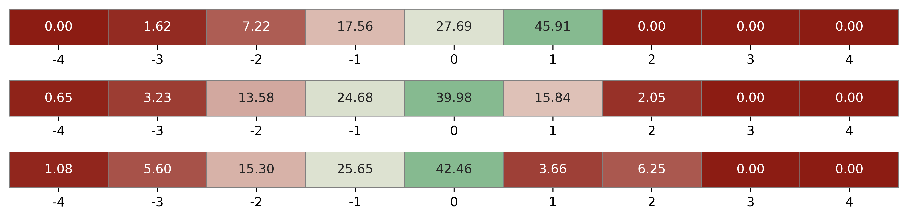
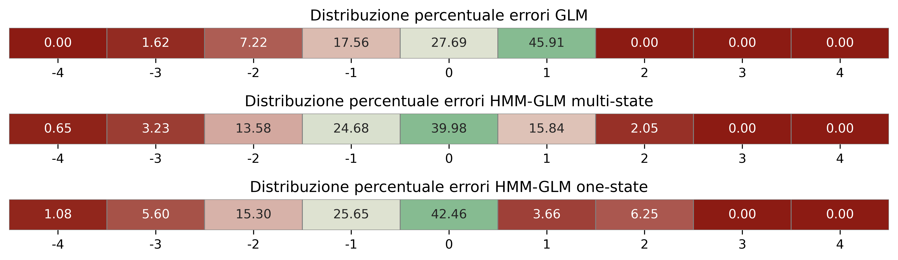

```{r}
#| include: false
source("../renv/activate.R")
# indico a reticulate quale versione di python usare, in modo da avere tutti i pacchetti già salvati
Sys.setenv(RETICULATE_PYTHON = "C:/Users/erik4/AppData/Local/Programs/Python/Python313/python.exe")
# here::i_am("/slides/presentation-thesis.qmd")
pacman::p_load(
    tidyverse,
    gt,
    here,
    gtsummary
)

source(here("R/data_elaboration.R"))
if (knitr::is_latex_output()) {
  bg_color<- "#ffff"
  source(here("R/plot_theme_pdf.R"))
  theme_set(pdf_theme + theme(text = element_text(size = 24)))
}else{
  bg_color<- "#F4ECE2"
  source(here("R/plot_theme_html.R"))
  theme_set(html_theme + theme(text = element_text(size = 24)))
  }
```

```{python}
#| include: false
from pyprojroot import here
import sys

python_dir = str(here("python"))
if python_dir not in sys.path:
    sys.path.insert(0, python_dir)

# %load_ext autoreload
# %autoreload 2
```


## Indice {visibility="hidden"}

- Definizione del Problema

- I dati

- Modelli lineari generalizzati

- Modello Markoviano a strati nascosti

    - Definizione del modello

    - Numero degli strati nascosti

    - Risultati

- Diagnostiche del modello

    - Algoritmo Viterbi

    - Predizioni

    - Analisi delle performance

- Dashboard

- Conclusioni

## Definizione del Problema

<div style="height: 2em;"></div>

#### Domanda

> Come possiamo predire le **future donazioni** dei donatori e il loro **comportamento** basandoci sulle osservazioni passate di ciascun individuo e le sue informazioni sociodemografiche?

<div style="height: 2em;"></div>

#### Scopo

- **Costruire** un modello per predire la propensione alla donazioni agli anni successivi
- **Scoprire** comportamenti latenti dei profili e pattern comuni di donazione
- **Quantificare** l'impatto delle informazioni sociodemografiche e di shock temporali (COVID-19) 


## Dati


::::{.columns}

:::{.column}

<div style="height: 2em;"></div>

#### I dati in nostro possesso

- Un panel di oltre 9.000 donatori a Trieste
- Il conteggio del numero di donazioni annue (0–4 per anno), nel periodo 2009–2023

<div style="height: 2em;"></div>

#### Da dove vengono

- Centro trasfusionale dell'ASUGI
- Dati anonimizzati
- Informazioni disponibili: genere e anno di nascita
:::


:::{.column}
```{r}
#| fig-height: 8
#| fig-dpi: 300
source(here("R/data_integration_istat.R"))

data |> 
  left_join(residenti, by = c("gender", "year", "age")) |>
  filter(year %% 4 == 3) |>
  summarise(
    ratio_donors = n() / first(population),
    .by = c(gender, year, age)
  ) |> 
  filter(age < 75) |> 
  ggplot(aes(x = age, y = ratio_donors, fill = gender, alpha = year)) +
  geom_col() +
  facet_grid(rows = vars(year), cols = vars(gender)) +
  scale_y_continuous(labels = scales::percent_format()) +
  scale_alpha_continuous(range = c(.4, 1)) +
  labs(
    title = "Distribuzione del tasso di donatori tra i residenti",
    subtitle = "Per anno, età e genere",
    y = "Tasso donatori sui residenti",
    x = "Età"
  ) +
  theme(legend.position = "none") 
```
:::

::::


## Previsione del numero totale di donazioni per individuo

<div style="height: 0.5em;"></div>

::::{.columns}

:::{.column}

#### Modello GLM

<div style="height: 0.25em;"></div>

Distribuzione scelta: Poisson troncata

Ideale per variabili che rappresentano conteggi **strettamente positivi**.

Il modello è analogo a un GLM (*GLM-like*).[^1]

Adatto quando gli **zeri** sono strutturalmente **assenti** nel campione.

$$
\Pr(Y=y \mid Y>0,\ \mu) = \frac{e^{-\mu}\,\mu^{y}/y!}{1-e^{-\mu}},
\qquad y=1,2,\dots
$$

:::

:::{.column}
```{r}
#| fig-height: 8
library(tidymodels)
library(broom.mixed)
readRDS(here::here("R/fit_tpoisson.rds")) |> 
   tidy(conf.int = TRUE, effects = "fixed") |>
  dotwhisker::dwplot(
    dot_args = list(size = 2, color = "black"),
    show_intercept = TRUE,
    whisker_args = list(color = "black"),
    vline = ggplot2::geom_vline(xintercept = 0, colour = "grey50", linetype = 2)
  ) +
    labs(
      title = "Coefficienti del modello di Poisson troncato in zero"
    )
```
:::

::::

[^1]: Il valore atteso è: $\mathbb{E}[Y \mid Y>0] = \frac{\mu}{1-e^{-\mu}} \neq \mu,$ dove $1-e^{-\mu}$ è il termine di normalizzazione.

# Modello Markoviano a Stati Nascosti

## Definizione del modello

Diagramma della struttura di un modello markoviano a stati latenti con a priori bayesiane ed un modello di regressione lineare sulle emissioni

{fig-align="center"}

## Scelta del numero degli stati nascosti

 <!-- la log-evidence è simile alla log verosimiglianza ma in contesto bayesiano ed è la verosimiglianza mediata su tutti i possibili valori dei parametri-->

Per la scelta del numero di stati latenti viene utilizzato il **Bayesian Information Criterion**:

$$
\text{BIC} = k\ln(n) - 2\ln(\widehat L)
\qquad
\text{BIC-like} = \ln(\widehat L) - \frac{1}{2} k \ln(n)
$$

Il numero di stati latenti scelto è di **3**.


## Risultati: occupazione degli stati iniziali

::::{.columns}
:::{.column width="60%"}

<div style="height: 1em;"></div>

- Gran parte dei donatori inizia nello stato di "non-donatore"

<div style="height: 0.25em;"></div>

- I donatori più giovani e le donne hanno una probabilità maggiore di iniziare dallo stato di "non-donatore" 

<div style="height: 0.25em;"></div>

- Dei donatori più anziani quasi il 60% sono "donatori frequenti"

<div style="height: 0.25em;"></div>

- Risultato coerente con il completamento longitudinale delle non-donazioni

<div style="height: 0.25em;"></div>

- Una distribuzione a priori asimmetrica per garantire consistenza nelle etichette: $\pi_{\text{base}} \sim \text{Dirichlet}(\boldsymbol{\alpha}_\pi)$

:::
:::{.column width="40%"}


:::
::::

::: {layout="[[1,1]]"}

{fig-align="center" width=50% height=80%}

{fig-align="center" width=70% height=80%}

:::


## Risultati: matrice di transizione

::::{.columns}
:::{.column width="50%"}

<div style="height: 1em;"></div>

- I donatori rimangono abbastanza **stabili** nei loro stati (>80%)

<div style="height: 0.25em;"></div>

- Dallo stato di "non-donatore" si passa a "donatore occasionale" e "donatore frequente" (>15%)

<div style="height: 0.25em;"></div>

- Dallo stato di "donatore occasionale" si passa a "non-donatore"

<div style="height: 0.25em;"></div>

- Dallo stato di "donatore frequente" si passa allo stato di "donatore occasionale"

<div style="height: 0.25em;"></div>

- Sono state valutate **a priori** non informative e informative "diagonali": $A_{\text{base}}[k,\cdot] \sim \text{Dirichlet}(\boldsymbol{\alpha}_{A_k})$ 

:::
:::{.column width="50%"}

{fig-align="center" width=85%}
:::
::::


## Coefficienti della matrice di transizione {auto-animate=true}


::::{.columns}
:::{.column width="50%"}

<div style="height: 1em;"></div>

- $0 \to 0$: La probabilità di rimanere nello stato "non-donatore" decresce all'aumentare dell'età, ad eccezione della fascia +65[^2]

<div style="height: 0.25em;"></div>

- Probabilità maggiori nelle transizioni $1 \to 0$ e $2 \to 1$ (decremento di numero di donazioni annue) nella fasce d'età più alte

<div style="height: 0.5em;"></div>

Effetto **COVID-19**:

- Diminuzione delle probabilità nelle transizioni a "non-donatore" ($0 \to 0$, $1 \to 0$ e $2 \to 0$)

<div style="height: 0.25em;"></div>

- Incremento delle probabilità nelle transizioni a "donatore occasionale" ($0 \to 1$ e $1 \to 1$)

<div style="height: 0.25em;"></div>

- Incremento delle probabilità di transizione da "donatore frequente" a "donatore occasionale" ($2 \to 1$)
 

:::
:::{.column width="50%"}


:::
::::

[^2]: Il limite in Italia per donare sangue è di 65 anni, ad eccezione dei donatori regolari, che è estesa a 70, previa consultazione medica.

## {auto-animate=true}


## Coefficienti dei GLM


## Algoritmo Viterbi

<div style="height: 1em;"></div>

::::{.columns}

:::{.column width="70%"}

**Obiettivo:** Ottenere gli stati più probabili per ogni anno e per ogni donatore.

<div style="height: 0.5em;"></div>

$z_{1:T}^*$ si ottiene per programmazione dinamica, con un passo base e un passo iterativo.

<div style="height: 1em;"></div>

1. 
**Inizializzazione:** si ricavano le probabilità per stato al tempo iniziale. 
$$
\delta_1(k)=\log \pi_k(x^\pi) + \log \Pr\bigl(y_1\mid z_1{=}k\bigr), 
$$

2. 
**Forward:** Ricorsione per $t=2,\dots,T$ cercando il massimo della probabilità di stare nello stato precedente, $k$, sommato alla probabilità di spostarsi al tempo $t$ dallo stato $k$ allo stato $j$.
Successivamente viene sommata la log-probabilità di emissione.
$$
\delta_t(j)=\max_{k}\Big\{\delta_{t-1}(k) + \log A_{k\to j}\!\bigl(x^A_t\bigr)\Big\} + \log \Pr\bigl(y_t\mid z_t{=}j\bigr),
$$
$$
\psi_t(j) = \arg\max_{k} \Big\{ \delta_{t-1}(k) + \log A_{k\to j}(x^A_t) \Big\}
$$

3. 
**Backtracking:** cercare l'argomento che massimiza la funzione $\delta$.
$$
z_T^*=\arg\max_j \delta_T(j),\qquad
z_{t-1}^* = \psi_t(z_t^*) \quad (t = T, \dots, 2)
$$

:::

:::{.column width="30%"}


:::
::::

## Occupazioni degli stati per anno {.nostretch}


## Esempio di predizione

<div style="height: 3em;"></div>

::::{.columns}

:::{.column width="50%"}

```{r}
#| fig-height: 7
donations <- tibble(
  donations = factor(0:4),
  probability = c(0.175, 0.275, 0.252, 0.164, 0.131)
)

ggplot(donations, aes(x = donations, y = probability)) +
  geom_col(fill = "#86ba90ff") +
  geom_text(aes(label = scales::percent(probability)), vjust = -0.3) +
  scale_y_continuous(labels = scales::percent_format(accuracy = 1), limits = c(0, 0.3)) +
  labs(
    title = "Probabilità delle donazioni future",
    x = "Numero di future donazioni",
    y = "Probabilità (%)"
  ) +
  annotate("text", x = 4.5, y = 0.28, label = "E(donazioni) = 1.87\nProb (≥1) = 0.824", size = 6)
```

:::


:::{.column width="50%"}


:::

::::

## Altri esempi


::: {layout="[[1,1],[1,1]]"}

{fig-align="center" width=65%}

{fig-align="center" width=65%}

{fig-align="center" width=65%}

{fig-align="center" width=65%}

<!-- Predizione del numero di donazioni per diversi profili di donatore -->
:::

## Confronto con un GLM  {auto-animate="true"}

- Come benchmark è stato utilizzato un GLM Poisson con le medesime covariate: in questo modo l'aumento di performance è attribuibile alla componente latente

- Suddivisione del **dataset** di allenamento e di test **stratificato** per genere e fascia d'età

- Come metrica di confronto è stata scelta l'**accuracy**:
$$
\mathrm{Accuracy} = \frac{1}{N}\sum_{n=1}^N \mathbf{I}\!\big\{\operatorname{round}(\hat y_n) = y_n\big\},
$$

- Per il punto di previsione per il modello HMM-GLM sono stati usati **due metodi** distinti:

  - considereremo la mistura sugli stati

  - selezioneremo solo lo stato più probabile in $T{+}1$ e applicheremo il GLM di quello stato

:::{data-id="plots"}

:::

## Confronto con un GLM  {auto-animate="true"}

:::{data-id="plots"}

:::

- Il modello HMM-GLM ottiene un’**accuracy superiore** al GLM (42% vs 28%)

- Dal HMM-GLM predetto sul solo stato più probabile emerge una forte massa in 0 (predizione esatta) e, a seguire, in -1 e -2 (sottostima), mostrando una **forte asimmetria** degli **errori**

- Il modello HMM-GLM che, invece, considera tutti possibili stati futuri e calcola una predizione pesata su di essi, si ottiene un'accuracy leggermente minore ma una **simmetria maggiore** e l'intervallo $[-1, 1]$ contiene all'incirca l'**80%** degli errori

- La maggior parte degli errori del GLM è tra -1 e 1 con dispersione più simmetrica

## Conclusioni

### Punti di forza

- Dataset pulito e con un alto numero di osservazioni in confronto con il numero di covariate disponibili

- Il modello esegue un **raggruppamento dinamico** per ciascun anno: adattandosi al complesso e mutabile comportamento umano

- Il modello è riuscito a "far parlare" le variabili, svelando **pattern nascosti**, più complessi e difficilmente ottenibili

### Criticità riscontrate

- **Mancanza di informazioni** socio-demografiche sui donatori

- Si è provato ad integrare covariate, tramite i dati forniti dall'ISTAT ma senza successo

- Lo studio è stato limitato **unicamente** alle **donazioni di sangue**, scartando in principio gli altri tipi di donazione, come il plasma.

- I **donatori** sono stati **filtrati**, prendendo solo donatori compresi tra i 18 e i 70 anni d'età, ovvero in età donativa.

### Idee per il futuro

- **Integrazione di ulteriori covariate**, come l'informazione se il donatore avesse in passato effettuato altri tipi di donazione. Ciò porterebbe probabilmente a un quarto stato: i "*super*-donatori".

- Avendo a disposizione i dati di diversi centri trasfusionali, si potrebbe condurre un'**analisi su dati panel**, prendendo diverse informazioni sulla popolazione residente, come la percentuale di studenti, lavoratori, pensionati, ...

- L'introduzione di **prior** anche sulle altre componenti del modello, come i **coefficienti delle emissioni**. Questa parte, però, richiederebbe anche una revisione dei successivi algoritmi implementati e usati per le diagnostiche del modello

# Grazie dell'ascolto

> *"All models are wrong, but some are useful."*\
> — George Box

<!-- ::::{.columns}
:::{.column width="50%"}

:::
:::{.column width="50%"}

:::
:::: -->
