```{r}
#| include: false
source("../renv/activate.R")
# indico a reticulate quale versione di python usare, in modo da avere tutti i pacchetti già salvati
Sys.setenv(RETICULATE_PYTHON = "C:/Users/erik4/AppData/Local/Programs/Python/Python313/python.exe")
# here::i_am("/slides/presentation-thesis.qmd")
pacman::p_load(
    tidyverse,
    gt,
    here,
    gtsummary
)

source(here("R/data_elaboration.R"))
if (knitr::is_latex_output()) {
  bg_color<- "#ffff"
  source(here("R/plot_theme_pdf.R"))
  theme_set(pdf_theme + theme(text = element_text(size = 24)))
}else{
  bg_color<- "#F4ECE2"
  source(here("R/plot_theme_html.R"))
  theme_set(html_theme + theme(text = element_text(size = 24)))
  }
```

```{python}
#| include: false
from pyprojroot import here
import sys

python_dir = str(here("python"))
if python_dir not in sys.path:
    sys.path.insert(0, python_dir)

# %load_ext autoreload
# %autoreload 2
```


## Indice

- Definizione del Problema

- I dati

- Modelli lineari generalizzati

- Modello Markoviano a strati nascosti

    - Definizione del modello

    - Numero degli strati nascosti

    - Risultati

- Diagnostiche del modello

    - Algoritmo Viterbi

    - Predizioni

    - Analisi delle performance

- Dashboard

- Conclusioni

## Definizione del Problema

\vspace{5em}

#### Domanda

> Come possiamo predire le future donazioni dei donatori e il loro comportamento basandoci sulle osservazioni passate di ciascun individuo e le sue informazioni sociodemografiche?

\vspace{5em}

#### Scopo

- **Costruire** un modello per predire la propensione nelle donazioni agli anni successivi
- **Scoprire** comportamenti latenti dei profili e pattern comuni di donazione
- **Quantificare** l'impatto delle informazioni sociodemografiche e di shock temporali (Covid-19) 


## Introduzione


::::{.columns}

:::{.column}
#### I dati in nostro possesso

- Un panel di oltre 9.000 donatori a Trieste
- Il conteggio del numero di donazioni annue (0–4 per anno), nel periodo 2009–2023

#### Da dove vengono

- Centro trasfusionale dell'ASUGI
- Dati anonimizzati
- informazioni disponibili: genere ed anno di nascita
:::


:::{.column}
```{r}
#| fig-cap: Distribuzione del tasso di donatori tra i residenti per anno, età e genere
#| fig-cap-location: bottom
#| label: fig-donor_ratio
#| fig-height: 8
#| fig-dpi: 300
source(here("R/data_integration_istat.R"))

data |> 
  left_join(residenti, by = c("gender", "year", "age")) |>
  filter(year %% 4 == 3) |>
  summarise(
    ratio_donors = n() / first(population),
    .by = c(gender, year, age)
  ) |> 
  filter(age < 75) |> 
  ggplot(aes(x = age, y = ratio_donors, fill = gender, alpha = year)) +
  geom_col() +
  facet_grid(rows = vars(year), cols = vars(gender)) +
  scale_y_continuous(labels = scales::percent_format()) +
  scale_alpha_continuous(range = c(.4, 1)) +
  labs(
    title = "Donors population ratio by gender and year",
    y = "Penetration"
  ) +
  theme(legend.position = "none") 
```
:::

::::


## Previsione numero totale di donazioni per individuo

::::{.columns}

:::{.column}

#### Distribuzione Poisson troncata

Ideale per variabili che rappresentano conteggi **strettamente positivi**.

Il modello è un *GLM-like* e non un GLM canonico in senso stretto.

Adatto quando gli **zeri** sono strutturalmente **assenti** nel campione.

$$
\Pr(Y=y \mid Y>0,\ \mu) = \frac{e^{-\mu}\,\mu^{y}/y!}{1-e^{-\mu}},
\qquad y=1,2,\dots
$$

:::{.callout-warning title="GLM canonico"}

$\mu>0$ è l’intensità Poisson "non troncata"

Il valore atteso è:

$$
\mathbb{E}[Y \mid Y>0] = \frac{\mu}{1-e^{-\mu}} \neq \mu,
$$

dove $1-e^{-\mu}$ è il termine di normalizzazione.

:::

:::

:::{.column}

```{r}
#| fig-cap: Coefficienti del modello di Poisson troncato in zero
#| fig-cap-location: bottom
#| fig-height: 8
#| label: fig-coeff_tpoiss
library(tidymodels)
library(broom.mixed)
readRDS(here::here("R/fit_tpoisson.rds")) |> 
   tidy(conf.int = TRUE, effects = "fixed") |>
  dotwhisker::dwplot(
    dot_args = list(size = 2, color = "black"),
    show_intercept = TRUE,
    whisker_args = list(color = "black"),
    vline = ggplot2::geom_vline(xintercept = 0, colour = "grey50", linetype = 2)
  ) 
```
:::

::::


# Modello Markoviano a Strati Nascosti

## Definizione del modello

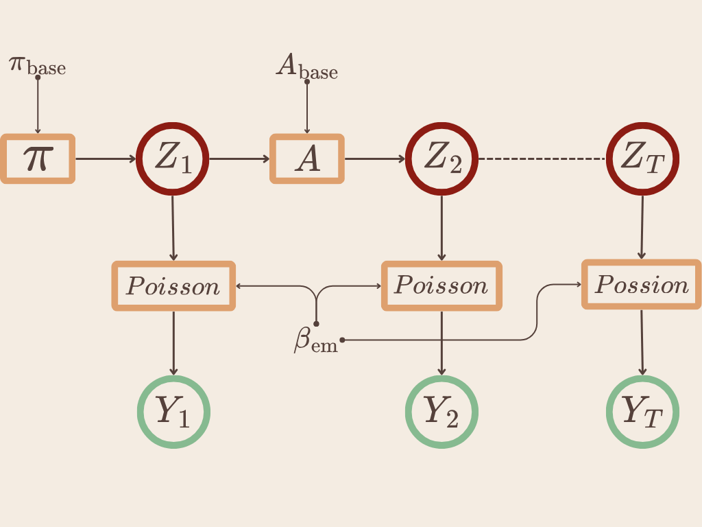

## Scelta del numero degli strati nascosti

 <!-- la log-evidence è simile alla log verosimiglianza ma in contesto bayesiano ed è la verosimiglianza mediata su tutti i possibili valori dei parametri-->

Per la scelta del numero di stati latenti viene utilizzato il **Bayesian Information Criterion**

$$
\text{BIC} = k\ln(n) - 2\ln(\widehat L)
$$


$$
\text{BIC-like} = \ln(\widehat L) - \frac{1}{2} k \ln(n)
$$

{#fig-bic}

## Risultati

::: {#fig-hmm_results layout="[[1,1]]"}

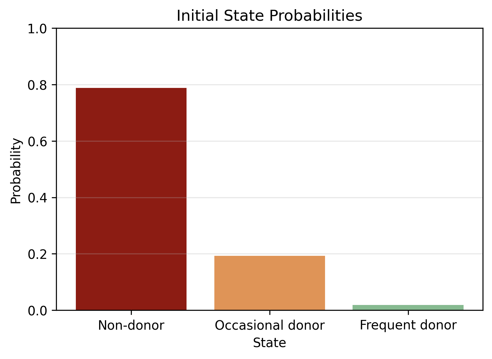{#fig-init} 

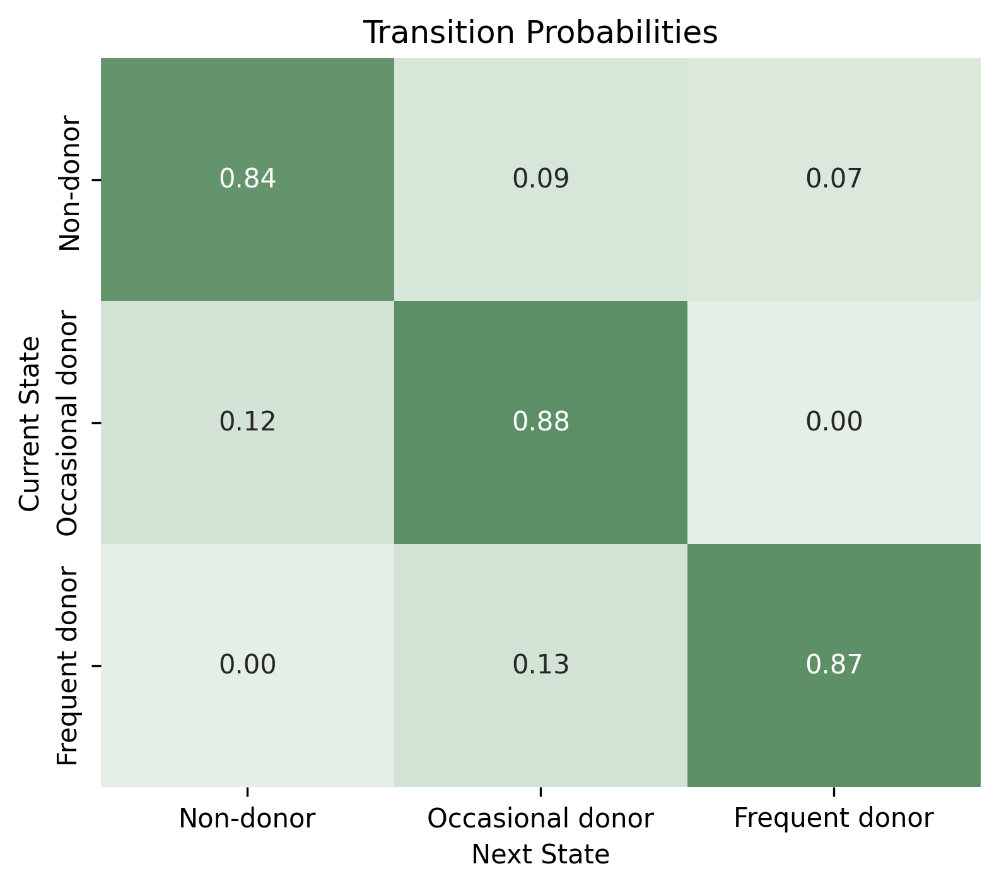{#fig-trans} 

Componenti markoviane del modello
:::

## Coefficienti delle probabilità iniziali

::: {#fig-pi_results layout="[[1,1]]"}

{fig-align="center" width=80%}

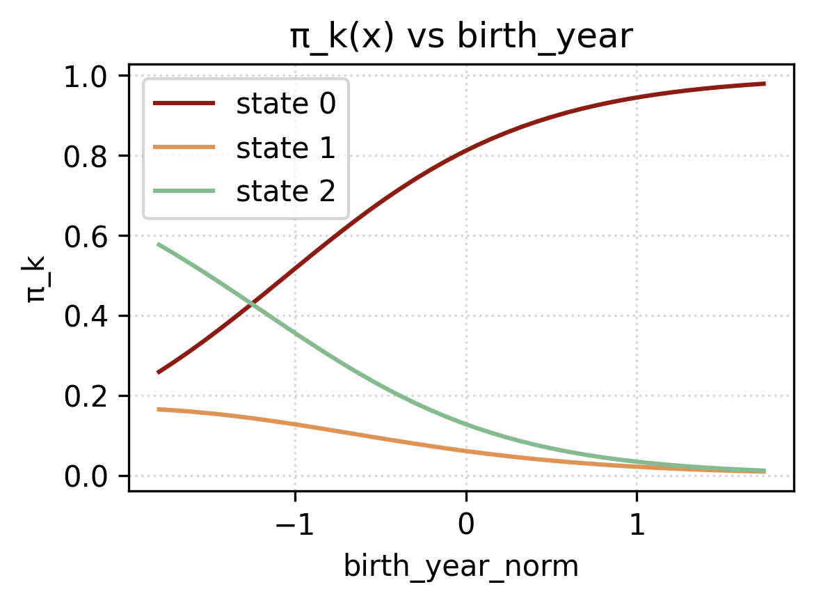{#fig-pi_age}

Grafici sui valori dei coefficienti $W_\pi$
:::

## Coefficienti della matrice di transizione

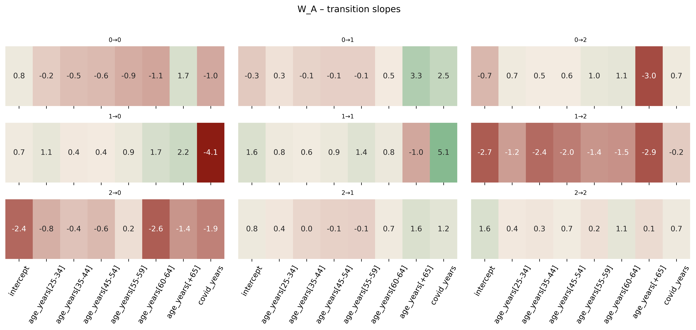{#fig-coeff_trans}

## Coefficienti dei GLM

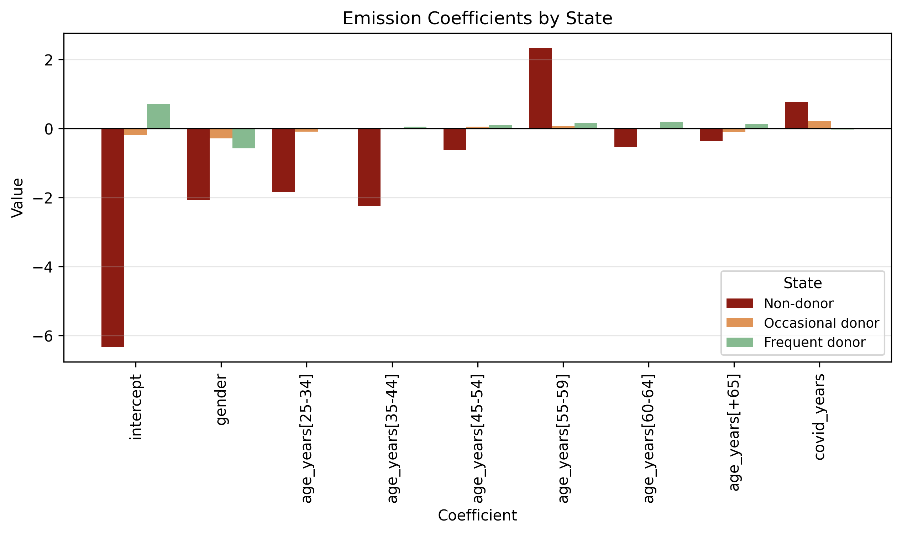{#fig-em} 

## Algoritmo Viterbi

::::{.columns}

:::{.column width="70%"}

**Obiettivo:** Ottenere gli stati più probabili per ogni anno e per ogni donatore.

$z_{1:T}^*$ si ottiene per programmazione dinamica, con un passo base e un passo iterativo.

1. 
**Inizializzazione:** si ricavano le probabilità per stato al tempo iniziale. 
$$
\delta_1(k)=\log \pi_k(x^\pi) + \log \Pr\bigl(y_1\mid z_1{=}k\bigr), 
$$

2. 
**Forward:** Ricorsione per $t=2,\dots,T$ cercando il massimo della probabilità di stare nello stato precedente, $k$, sommato alla probabilità di spostarsi al tempo $t$ dallo stato $k$ allo stato $j$.
Successivamente viene sommata la log-probabilità di emissione.
$$
\delta_t(j)=\max_{k}\Big\{\delta_{t-1}(k) + \log A_{k\to j}\!\bigl(x^A_t\bigr)\Big\} + \log \Pr\bigl(y_t\mid z_t{=}j\bigr),
$$
$$
\psi_t(j) = \arg\max_{k} \left{ \delta_{t-1}(k) + \log A_{k\to j}(x^A_t) \right}
$$

3. 
**Backward:** cercare l'argomento che massimiza la funzione $\delta$.
$$
z_T^*=\arg\max_j \delta_T(j),\qquad
z_{t-1}^* = \psi_t(z_t^*) \quad (t = T, \dots, 2)
$$

:::

:::{.column width="30%"}

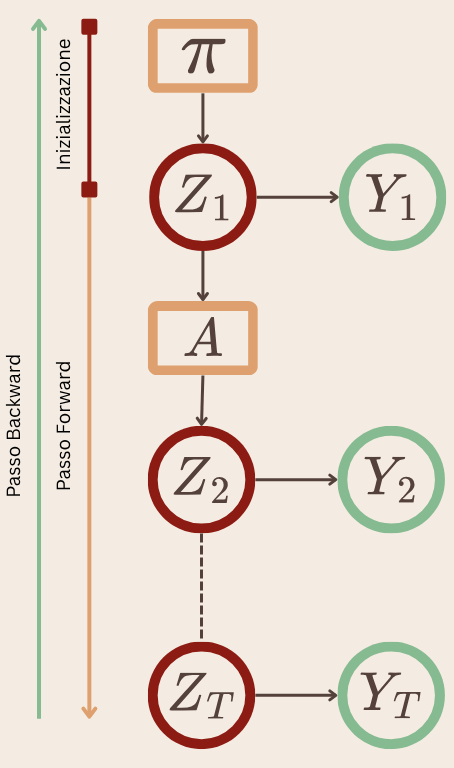

:::
::::

## Occupazioni degli stati per anno

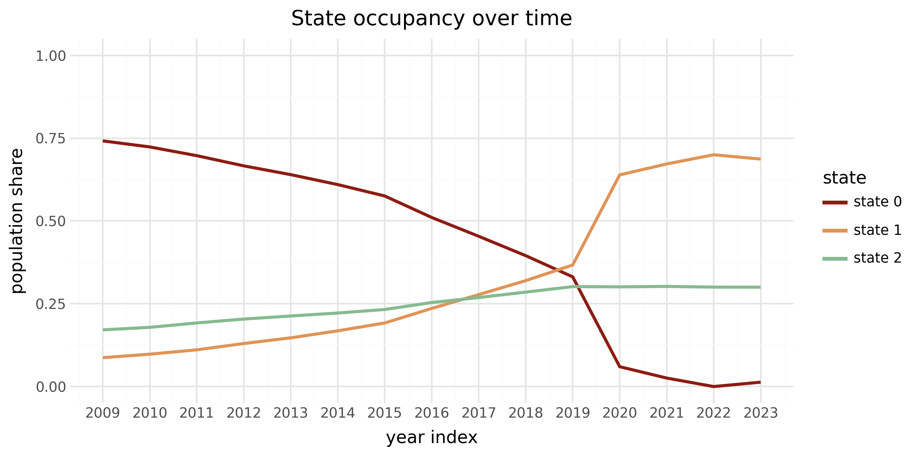{#fig-state_occupancy}

## Esempio di predizione


| Years (20XX)| 09 | 10 | 11 | 12 | 13 | 14 | 15 | 16 | 17 | 18 | 19 | 20 | 21 | 22 |
| ----------- | -- | -- | -- | -- | -- | -- | -- | -- | -- | -- | -- | -- | -- | -- |
| Counts      | 0  | 0  | 0  | 3  | 4  | 3  | 4  | 3  | 4  | 3  | 2  | 2  | 2  | 3  |
| Viterbi st. | 0  | 0  | 0  | 2  | 2  | 2  | 2  | 2  | 2  | 2  | 2  | 2  | 2  | 2  |
: Esempio di predizione dello stato latente per anno in base al numero di donazioni effettuate {#tbl-path}

::::{.columns}

:::{.column width="50%"}

```{r}
#| fig-height: 7
donations <- tibble(
  donations = factor(0:4),
  probability = c(0.175, 0.275, 0.252, 0.164, 0.131)
)

ggplot(donations, aes(x = donations, y = probability)) +
  geom_col() +
  geom_text(aes(label = scales::percent(probability)), vjust = -0.3) +
  scale_y_continuous(labels = scales::percent_format(accuracy = 1), limits = c(0, 0.3)) +
  labs(
    title = "Probabilità delle donazioni future",
    x = "Numero di future donazioni",
    y = "Probabilità (%)"
  ) +
  annotate("text", x = 4.5, y = 0.28, label = "E(donazioni) = 1.87\nProb (≥1) = 0.824", size = 6)
```

:::


:::{.column width="50%"}

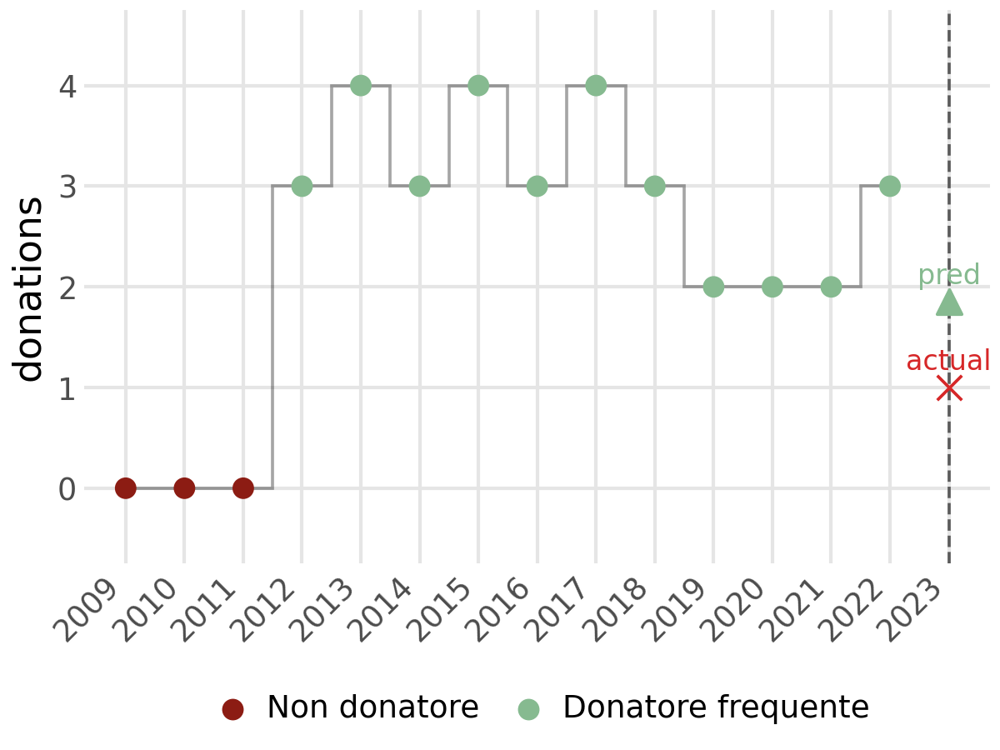

:::

::::

## Altri esempi


::: {layout="[[1,1],[1,1]]"}

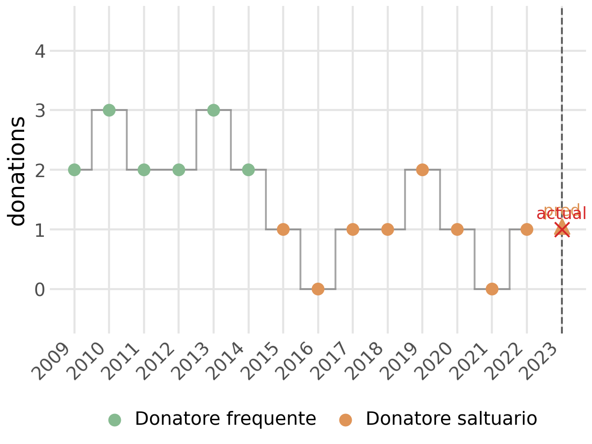{fig-align="center" width=65%}

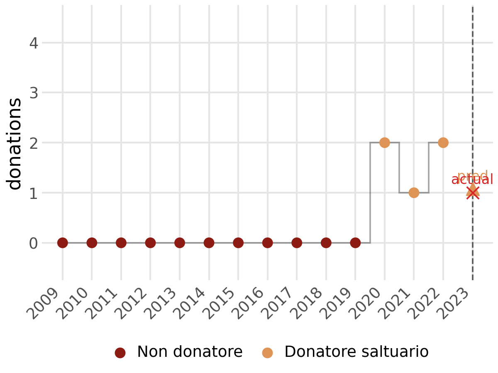{fig-align="center" width=65%}

{fig-align="center" width=65%}

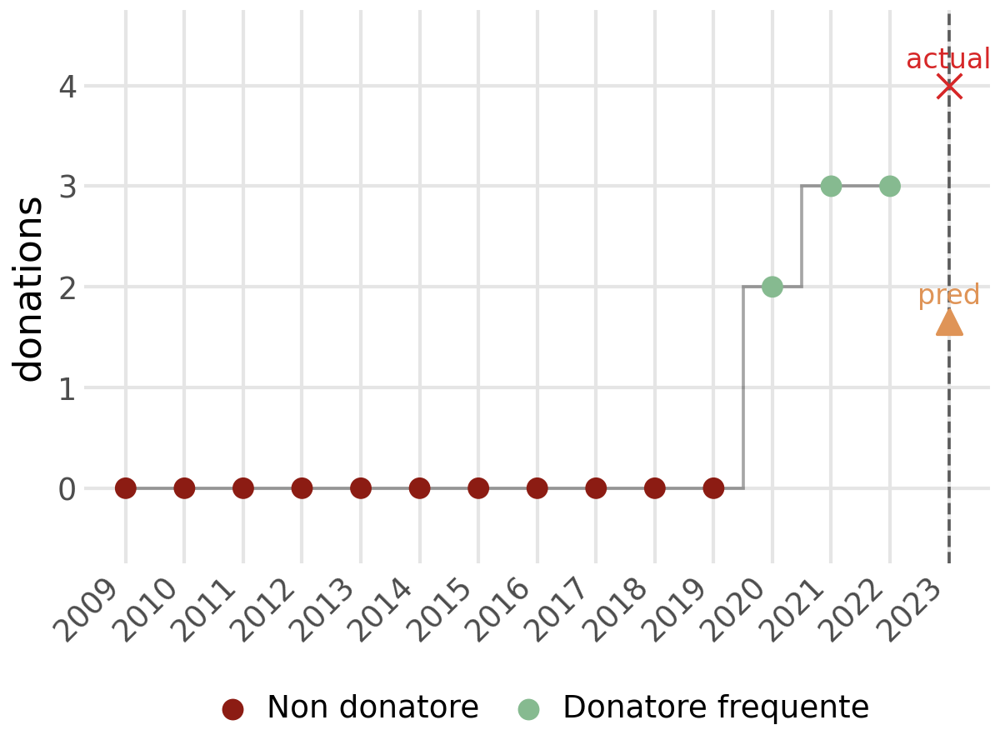{fig-align="center" width=65%}

<!-- Predizione del numero di donazioni per diversi profili di donatore -->
:::

## Confronto con un GLM


::: {#fig-errori layout="[[1],[1],[1]]"}

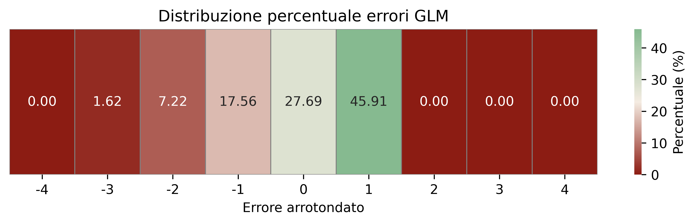{#fig-err_glm}

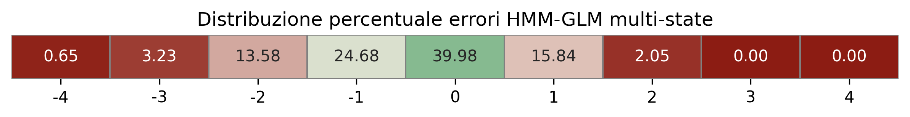{#fig-err_hmm_ms}

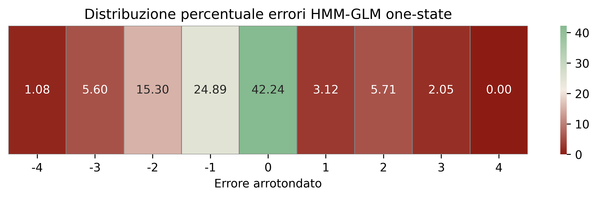{#fig-err_hmm_os}

Mappe di calore sulla frequenza degli errori per i modelli testati
:::