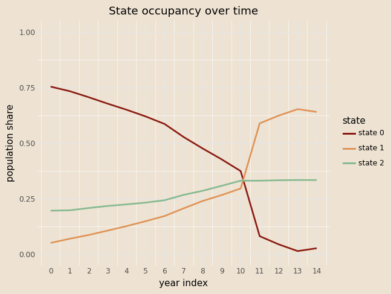
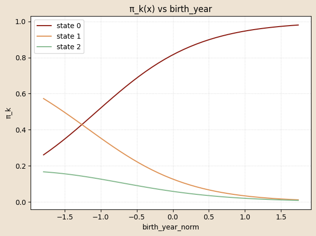
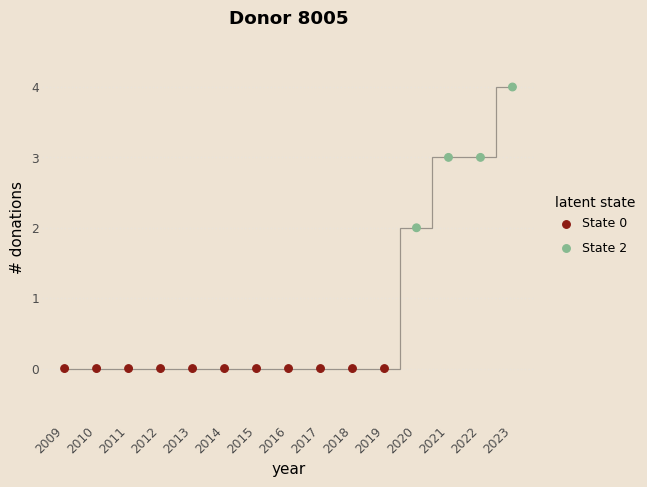
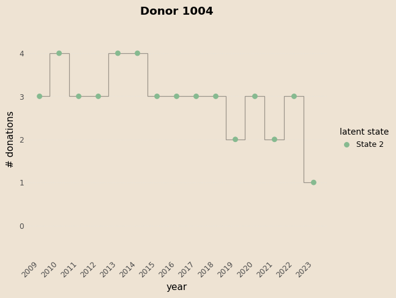
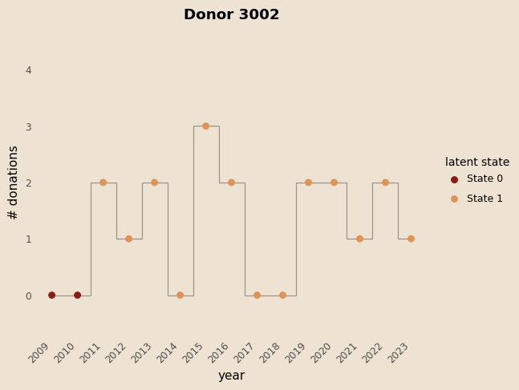
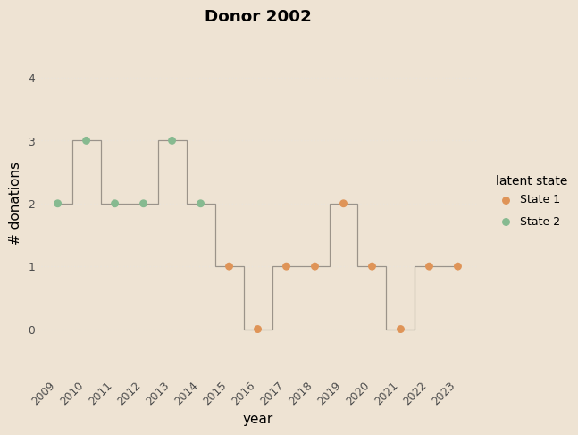
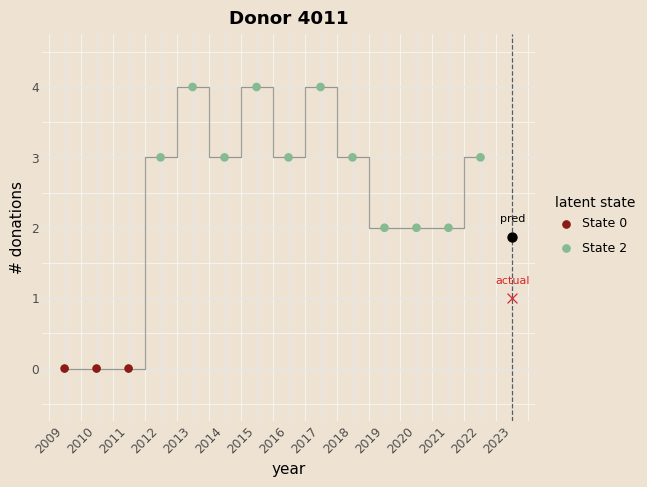
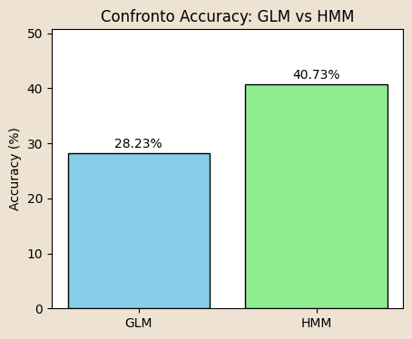
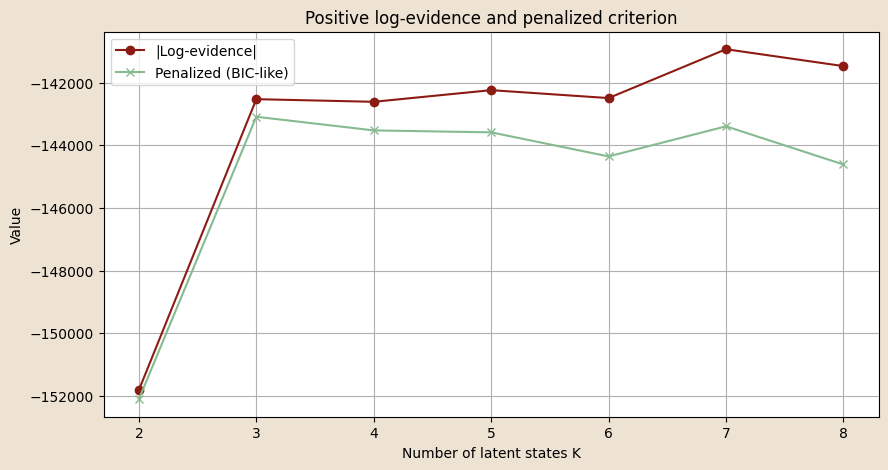
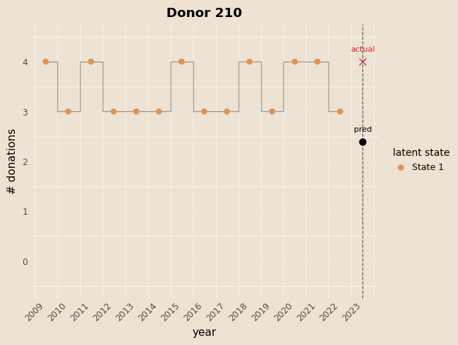

```{python}
#| echo: false
#| include: false
from pyprojroot import here
import sys

python_dir = str(here("python"))
if python_dir not in sys.path:
    sys.path.insert(0, python_dir)

%load_ext autoreload
%autoreload 2
```

## Summary

-   About the data

-   Bayesian HMM with GLM on emissions


-   Viterbi algorithm

-   Check of the model

-   Number of latent states

## About the Data 

:::{.incremental}

#### What we have

-   A longitudinal panel of 9,000+ unique blood donors in Trieste
-   Annual counts of donations per donor (0–4 per year), spanning 2009–2023

#### Where it comes from

-   ASUGI transfusion service operational registers
-   Fully anonymised data; available covariates: gender (M/F) and year of birth

#### Objective

-   Build a predictive model for future donation propensity and counts
-   Discover latent behavioural profiles and common temporal patterns
-   Quantify the impact of age, gender, and shocks (e.g., COVID-19) on dynamics <!-- - Provide actionable forecasts for blood supply planning -->

#### Limitations

-   Sparse covariates (only gender and birth year)
-   No clinical or socio-economic info <!-- - Donors may not be Trieste residents; population denominators are estimated externally --> <!-- - Anonymisation prevents registry linkage and cohort enrichment -->

:::


## Bayesian HMM with GLM on emissions

:::{.incremental}
#### Initial-state distribution ($\pi$):

-   $\pi_{\text{base}}\sim\mathrm{Dirichlet}(\boldsymbol{\alpha}_{\pi})$

-   
  $$
  \Pr(z_{n,0}=k\mid x^{\pi}_n)=
  \operatorname{softmax}_k\!\bigl(
  \log\pi_{\text{base},k}+W_{\pi,k}\cdot x^{\pi}_n
  \bigr)
  $$

-   $x^{\pi}_n = (\text{intercept}, \text{birth_year_norm},\;\text{gender_code})\in\mathbb R^{3}$

#### Transition dynamics ($A$)

-   $A_{\text{base}}[k,\cdot]\sim\mathrm{Dirichlet}(\boldsymbol{\alpha}_{A_k})$

-  
  $$
  \Pr(z_{n,t}=j\mid z_{n,t-1}=k,\;x^{A}_{n,t})=
  \operatorname{softmax}_j\!\bigl(
    \log A_{\text{base},kj}+W_{A,kj}\cdot x^{A}_{n,t}
  \bigr).
  $$

-   $x^{A}_{n,t} = (\text{intercept}, \text{age_binned}, \text{covid_years})\in\mathbb R^{8}$

#### Emission ($\lambda$):

-  
$$
y_{n,t} \mid z_{n,t}=k \sim \mathrm{Poisson}\Big(
  \exp\Big(\beta_{em,k} \cdot x^{em}_{n,t}
  \Big)
\Big)
$$

-   $x^{em}_{n,t} = (\text{intercept}, \text{gender}, \text{age_binned},\;\text{covid_years})\in\mathbb R^{9}$

:::


## Results

::: {layout-nrow="2"}


{width="10%" height="10%" fig-align="center"}
:::


## Coefficients on $\pi$

::: {layout-ncol="2" layout="[10,-2,15]"}
{fig-align="center" width=170% height="170%"}


:::

## Coefficients on $A$


## $\beta$ coefficients 

{width="70%" height="70%"}


## Viterbi Algorithm

::: {.incremental}
-   **Goal:** for each donor find the MAP latent path $z_{0:T}^\ast$.


-   Dynamic programming\
    -   Initial step\
        $$
        \delta_0(k)=\log\hat\pi_k+\log\text{Poisson}(y_0\mid\hat\lambda_k)
        $$

    -   Recursion for $t=1,\dots,T$\
        $$
        \delta_t(j)=\max_k\bigl[\delta_{t-1}(k)+\log\hat A_{k j}\bigr]
                      +\log\text{Poisson}(y_t\mid\hat\lambda_j),
        $$ 
        $$
        \psi_t(j)=\arg\max_k\bigl[\delta_{t-1}(k)+\log\hat A_{k j}\bigr]
        $$

    -   Back-tracking\
        
        Start with $z_T^\ast=\arg\max_k\delta_T(k)$, then $z_{t-1}^\ast=\psi_t(z_t^\ast)$ for $t=T,\dots,1$.
:::


## Examples

::: {layout="[[50,50], [50,50]]"}
{width="55%"}

{width="55%"}

{width="55%"}

{width="55%"}
:::

## Prediction

```{python}

#| eval: false
#| code-line-numbers: "1-11"

# Forward filtering to get alpha_T for prediction
log_alpha = torch.empty(1, T_hist, K, dtype=torch.float32)
log_alpha[:, 0] = log_pi + emis_log[:, 0]

for t in range(1, T_hist):
    x_t = xA_te[:, t, :]
    logits = logA0.unsqueeze(0) + (W_A_t.unsqueeze(0) * x_t[:, None, None, :]).sum(-1)  # (1,K,K)
    log_A  = logits - torch.logsumexp(logits, dim=2, keepdim=True)
    log_alpha[:, t] = torch.logsumexp(log_alpha[:, t - 1].unsqueeze(2) + log_A, dim=1) + emis_log[:, t]

alpha_T = (log_alpha[:, -1] - torch.logsumexp(log_alpha[:, -1], dim=1, keepdim=True)).exp().cpu().numpy()[0]  # (K,)

# Next-year transition and emission
logits_next = np.log(A_base + 1e-30) + np.tensordot(W_A, x_A_next, axes=([2], [0]))  # (K,K)
A_next = _softmax_np(logits_next)                                                     # (K,K)
p_next = alpha_T @ A_next                                                             # (K,)

lam_next = np.exp(beta_em[:, 0] + (beta_em[:, 1:] @ x_em_next))                       # (K,)

# Predictive mixture for next year
expected_next = float((p_next * lam_next).sum())
p0 = float((p_next * np.exp(-lam_next)).sum())
prob_donate_next = 1.0 - p0

from scipy.stats import poisson as _po
pmf0k = np.array([(p_next * _po.pmf(k, lam_next)).sum() for k in range(max_k + 1)], dtype=float)
tail  = float(max(0.0, 1.0 - pmf0k.sum()))
pmf_dict = {str(k): float(pmf0k[k]) for k in range(max_k + 1)}
pmf_dict[f">={max_k+1}"] = tail
``` 

- foward algoritm 
$$
\left\{
\begin{aligned}
& \alpha(z_0) = P(x_0 \mid z_0)\, P(z_0) \\
& \alpha(z_T) = P(x_T \mid z_T)\, \sum_{z_{T-1}} P(z_{T} \mid z_{T-1}) \,\alpha(z_{T-1})
\end{aligned}
\right.
$$


## Prediction

```{python}

#| eval: false
#| code-line-numbers: "13-16"

# Forward filtering to get alpha_T for prediction
log_alpha = torch.empty(1, T_hist, K, dtype=torch.float32)
log_alpha[:, 0] = log_pi + emis_log[:, 0]

for t in range(1, T_hist):
    x_t = xA_te[:, t, :]
    logits = logA0.unsqueeze(0) + (W_A_t.unsqueeze(0) * x_t[:, None, None, :]).sum(-1)  # (1,K,K)
    log_A  = logits - torch.logsumexp(logits, dim=2, keepdim=True)
    log_alpha[:, t] = torch.logsumexp(log_alpha[:, t - 1].unsqueeze(2) + log_A, dim=1) + emis_log[:, t]

alpha_T = (log_alpha[:, -1] - torch.logsumexp(log_alpha[:, -1], dim=1, keepdim=True)).exp().cpu().numpy()[0]  # (K,)

# Next-year transition and emission
logits_next = np.log(A_base + 1e-30) + np.tensordot(W_A, x_A_next, axes=([2], [0]))  # (K,K)
A_next = _softmax_np(logits_next)                                                     # (K,K)
p_next = alpha_T @ A_next                                                             # (K,)

lam_next = np.exp(beta_em[:, 0] + (beta_em[:, 1:] @ x_em_next))                       # (K,)

# Predictive mixture for next year
expected_next = float((p_next * lam_next).sum())
p0 = float((p_next * np.exp(-lam_next)).sum())
prob_donate_next = 1.0 - p0

from scipy.stats import poisson as _po
pmf0k = np.array([(p_next * _po.pmf(k, lam_next)).sum() for k in range(max_k + 1)], dtype=float)
tail  = float(max(0.0, 1.0 - pmf0k.sum()))
pmf_dict = {str(k): float(pmf0k[k]) for k in range(max_k + 1)}
pmf_dict[f">={max_k+1}"] = tail
```

- Predictive state ditribution 
$$
P(z_{T+1}) = \alpha(z_T) \times A_{next}(x^{next}_A)
$$


## Prediction

```{python}

#| eval: false
#| code-line-numbers: "18-29"

# Forward filtering to get alpha_T for prediction
log_alpha = torch.empty(1, T_hist, K, dtype=torch.float32)
log_alpha[:, 0] = log_pi + emis_log[:, 0]

for t in range(1, T_hist):
    x_t = xA_te[:, t, :]
    logits = logA0.unsqueeze(0) + (W_A_t.unsqueeze(0) * x_t[:, None, None, :]).sum(-1)  # (1,K,K)
    log_A  = logits - torch.logsumexp(logits, dim=2, keepdim=True)
    log_alpha[:, t] = torch.logsumexp(log_alpha[:, t - 1].unsqueeze(2) + log_A, dim=1) + emis_log[:, t]

alpha_T = (log_alpha[:, -1] - torch.logsumexp(log_alpha[:, -1], dim=1, keepdim=True)).exp().cpu().numpy()[0]  # (K,)

# Next-year transition and emission
logits_next = np.log(A_base + 1e-30) + np.tensordot(W_A, x_A_next, axes=([2], [0]))  # (K,K)
A_next = _softmax_np(logits_next)                                                     # (K,K)
p_next = alpha_T @ A_next                                                             # (K,)

lam_next = np.exp((beta_em[:,:] @ x_em_next))                       # (K,)

# Predictive mixture for next year
expected_next = float((p_next * lam_next).sum())
p0 = float((p_next * np.exp(-lam_next)).sum())
prob_donate_next = 1.0 - p0

from scipy.stats import poisson as _po
pmf0k = np.array([(p_next * _po.pmf(k, lam_next)).sum() for k in range(max_k + 1)], dtype=float)
tail  = float(max(0.0, 1.0 - pmf0k.sum()))
pmf_dict = {str(k): float(pmf0k[k]) for k in range(max_k + 1)}
pmf_dict[f">={max_k+1}"] = tail
```

Predictive number of donation (Mixture of Poisson)
$$
\mathbb{E}[y_{T+1}] = \sum_{k=1}^K p_{T+1}(k)\,\lambda_{T+1}(k)
$$
$$
\Pr(y_{T+1} = k) = \sum_{i=1}^K p_{T+1}(i)\,\text{Poisson}\!\bigl(k \mid \lambda_{T+1}(i)\bigr)
$$


## Example

| Years       | 2009 | 2010 | 2011 | 2012 | 2013 | 2014 | 2015 | 2016 | 2017 | 2018 | 2019 | 2020 | 2021 | 2022 |
| ----------- | ---- | ---- | ---- | ---- | ---- | ---- | ---- | ---- | ---- | ---- | ---- | ---- | ---- | ---- |
| Counts      | 0    | 0    | 0    | 3    | 4    | 3    | 4    | 3    | 4    | 3    | 2    | 2    | 2    | 3    |
| Viterbi st. | 0    | 0    | 0    | 2    | 2    | 2    | 2    | 2    | 2    | 2    | 2    | 2    | 2    | 2    |

:::: {.columns}
::: {.column}
{fig-align="center" width=80%}
:::
::: {.column}
Next-state probabilities: [0.005, 0.125, 0.870]

Expected next donations: 1.871

Prob donate next: 0.824

| # donations | 0      | 1      | 2      | 3      | 4      | >=5   |
| ----------- | ----- | ----- | ----- | ----- | ----- | ----- |
| Probability | 0.175 | 0.275 | 0.252 | 0.164 | 0.082 | 0.049 |
:::
::::


## Evaluate performance

- Compare the model with a GLM

$$
y_{n,t} \mid z_{n,t}=k \sim \mathrm{Poisson}\Big(
  \exp\Big(\beta_{em,k} \cdot x^{em}_{n,t}
  \Big)
\Big)
$$

$$
x^{em}_{n,t} = (\text{intercept}, \text{gender}, \text{age_binned},\;\text{covid_years})\in\mathbb R^{9}
$$

::::{.columns}
:::{.column}
| Metric             | GLM    | HMM    | Abs diff | Rel diff % |
|--------------------|--------|--------|----------|------------|
| pred mean          | 0.96   | 0.41   | 0.55     | 135.46%    |
| obs mean           | 0.91   | 0.91   | 0.00     | 0.00%      |
| MSE                | 1.0158 | 1.2934 | -0.2777  | -21.47%    |
| Accuracy (round)   | 28.23% | 40.73% | -12.50pp | -30.69%    |
:::

:::{.column}

{width=55% fig-align="center"}

:::
::::

## Number of Latent States

**Goal:** estimate model evidence (Laplace approximation) for differnt values of number of states 


$$ 
\log p(X) \;\approx\; \log p\!\left(X \mid \hat{\theta}_{\text{MAP}}\right) \;+\; \text{Occam factor} 
$$

$$
\text{Occam factor} \;\approx\; -\tfrac{1}{2} M \, \ln N
$$

- Forward algorithm per valutare la likeliood function corrispondente ai parametri appresi 

$$ 
\left\{
\begin{aligned}
& \alpha(z_0) \;=\; p(z_0)\, p(x_0 \mid z_0) \\
& \alpha(z_T) \;=\; p(x_T \mid z_T)\; 
   \sum_{z_{n-1}} \alpha(z_{n-1})\, p(z_n \mid z_{n-1})
   \quad\text{per } n = 1,\dots, T.
\end{aligned}
\right.
\; ; \quad
\sum_{z_{T}} \alpha(z_{T}) = p\!\left(X \mid \hat{\theta}_{\text{MAP}}\right)
$$

{fig-align="center" width=55%}


## Conclusions

- The Bayesian HMM-GLMs permit to get the dynamic and hidden behavioural of the donors

- The model is an easy to read and to communicate but at the same time flexible

- The latent states are well defined and show a clear donation pattern

# Thanks


# Backup


## Model in Pyro

```{python}
#| eval: false
#| code-line-numbers: "|26,30,35-38|27,31,41-45|18-20,38,46"
@config_enumerate
def model(obs, x_pi, x_A, x_em):
    N, T = obs.shape

    # 1) Priors/parameters for initial and transition distribution
    pi_base = pyro.sample("pi_base", dist.Dirichlet(alpha_pi))          # [K]
    A_base  = pyro.sample("A_base",  dist.Dirichlet(alpha_A).to_event(1)) # [K, K]
    log_pi_base = pi_base.log()
    log_A_base  = A_base.log()

    # 2) Slope coefficients for initial and transition covariates (learned)
    W_pi = pyro.param("W_pi", torch.zeros(K, C_pi))                  # [K, C_pi]
    W_A  = pyro.param("W_A", torch.zeros(K, K, C_A))                 # [K, K, C_A]

    # 3) State-specific GLM emission coefficients (learned)
    beta_em = pyro.param("beta_em", torch.zeros(K, C_em))        # [K, C_em+1] (intercept + 9 dummies)

    with pyro.plate("seqs", N):
        # Initial hidden state probabilities: depend on x_pi via W_pi
        logits0 = log_pi_base + (x_pi @ W_pi.T)                      # [N, K]
        z_prev = pyro.sample("z_0",
                             dist.Categorical(logits=logits0),
                             infer={"enumerate": "parallel"})

        # Emission at t=0: state-specific GLM on covariates x_em[:, 0, :]
        log_mu0 = (x_em[:, 0, :] * beta_em[z_prev, :]).sum(-1)
        pyro.sample("y_0", dist.Poisson(log_mu0.exp()), obs=obs[:, 0])

        # For t = 1 ... T-1, update state and emit
        for t in range(1, T):
            x_t = x_A[:, t, :]                                      # [N, C_A]
            logitsT = (log_A_base[z_prev] + (W_A[z_prev] * x_t[:, None, :]).sum(-1))     # [N, K]
            z_t = pyro.sample(f"z_{t}",
                             dist.Categorical(logits=logitsT),
                             infer={"enumerate": "parallel"})

            # Emission: state-specific GLM at time t
            log_mu_t = (x_em[:, t, :] * beta_em[z_t, :]).sum(-1)
            pyro.sample(f"y_{t}", dist.Poisson(log_mu_t.exp()), obs=obs[:, t])
            z_prev = z_t
```

## GLM on emissions

**Priors:** the same of the Bayesian HMM.

**Slope parameters to learn**

-   $W_\pi \in \mathbb{R}^{K\times 2}$ (`birth_year_norm`, `gender_code`)

-   $W_A \in \mathbb{R}^{K\times K \times 8}$ (seven age-bin dummies `ages_norm`, `covid_years`)

-   $\beta_{em} \in \mathbb{R}^{K \times (1+9)}$ (`intercept`, `gender_code_tile`, `ages_norm`, `covid_years`)

**Initial-state distribution** 

$$
\Pr(z_{n,0}=k \mid x^\pi_n) =
\mathrm{softmax}_k \big( \log \pi_{\text{base},k} + W_{\pi,k} \cdot x^\pi_n \big)
$$

**Transition distribution** 

$$
\Pr(z_{n,t}=j \mid z_{n,t-1}=k, \ x^A_{n,t}) =
\mathrm{softmax}_j \big( \log A_{\text{base},kj} + W_{A,kj} \cdot x^A_{n,t} \big)
$$

**Emission** (one Poisson GLM for each latent state) 

$$
y_{n,t} \mid z_{n,t}=k \sim \mathrm{Poisson}\Big(
  \exp\Big(
      \beta_{em,k,0}
    + \sum_{m=1}^{9} \beta_{em,k,m} \cdot x^{em}_{n,t,m}
  \Big)
\Big)
$$


## Guide

Point-mass approximation:

-   $q(\pi_{\text{base}})=\delta(\pi_{\text{base}}-\hat\pi)$,

-   $q(A_{\text{base}})=\delta(A_{\text{base}}-\hat A)$.

All $\lambda$, $W_\pi$, $W_A$ are deterministic `pyro.param`s and they are optimized during the training. Discrete states $z_{n,t}$ are enumerated exactly, allowing all possible configurations to be calculated using `TraceEnum_ELBO` (without stochastic approximation).

```{python}
#| eval: false
#| code-line-numbers: "|26,30,35-38|27,31,41-45|18-20,38,46"
def guide(obs, x_pi, x_A, x_em):
    pi_q = pyro.param(
        "pi_base_map",
        torch.tensor([0.6, 0.3, 0.1]),
        constraint=dist.constraints.simplex
    )

    # Each row: simplex for state-to-state transitions
    A_init = torch.eye(K) * (K - 1.) + 1.
    A_init = A_init / A_init.sum(-1, keepdim=True)
    A_q = pyro.param(
        "A_base_map",
        A_init,
        constraint=dist.constraints.simplex
    )

    pyro.sample("pi_base", dist.Delta(pi_q).to_event(1))
    pyro.sample("A_base",  dist.Delta(A_q).to_event(2))
```


## Train and Test


| Split | Mean LL/seq |   MAE |  RMSE | Brier(y>0) |  NLL  |
|:------|------------:|------:|------:|-----------:|------:|
| Test  |     -13.052 | 0.5068| 0.7679|     0.1797 | 0.8832|
| Train |     -13.469 | 0.5183| 0.7834|     0.1790 | 0.9158|

## Viterbi Algorithm

```{python}

#| eval: false
#| code-line-numbers: "|1-11"
@torch.no_grad()
def viterbi_paths_glm(obs, x_pi, x_A, x_em, model_path=None):
    """
    Viterbi decoding for HMM with covariate-dependent pi, A, 
    and Poisson-GLM emissions (intercept already included in covariates).

    Parameters
    ----------
    obs  : (N, T) long
        Observed counts.
    x_pi : (N, C_pi) float
        Covariates for initial state distribution.
    x_A  : (N, T, C_A) float
        Covariates for transition probabilities.
    x_em : (N, T, C_em) float
        Covariates for emission GLM (already includes intercept).
    model_path : str or Path, optional
        Path to saved HMM parameters.

    Returns
    -------
    paths : (N, T) long tensor on CPU
        Most likely latent state sequence for each sequence.
    """
    # ---------------- load parameters ----------------
    W_pi, W_A, pi_base, A_base, beta_em = hmm_glm.load_hmm_params(model_path)

    # ---------------- device alignment ----------------
    device = obs.device
    obs = obs.to(device=device)
    x_pi = x_pi.to(device=device, dtype=torch.float32)
    x_A = x_A.to(device=device, dtype=torch.float32)
    x_em = x_em.to(device=device, dtype=torch.float32)

    W_pi   = _coerce_to_torch(W_pi, device)
    W_A    = _coerce_to_torch(W_A, device)
    pi_base = _coerce_to_torch(pi_base, device)
    A_base  = _coerce_to_torch(A_base, device)
    beta_em = _coerce_to_torch(beta_em, device)

    N, T = obs.shape
    K = int(pi_base.shape[0])

    # ---------------- emission log-probs ----------------
    # eta[n,t,k] = x_em[n,t,:] @ beta_em[k,:]
    eta = torch.einsum("ntc,kc->ntk", x_em, beta_em)  # (N,T,K)
    emis_log = dist.Poisson(rate=eta.exp()).log_prob(obs.unsqueeze(-1))  # (N,T,K)

    # ---------------- initial distribution ----------------
    log_pi_base = torch.log(pi_base + 1e-30)                 # (K,)
    logits0 = log_pi_base.view(1, K) + x_pi @ W_pi.T         # (N,K)
    log_pi = log_softmax_logits(logits0, dim=1)              # (N,K)

    delta = log_pi + emis_log[:, 0]                          # (N,K)
    psi = torch.zeros(N, T, K, dtype=torch.long, device=device)

    # ---------------- forward DP ----------------
    log_A_base = torch.log(A_base + 1e-30)                   # (K,K)
    for t in range(1, T):
        x_t = x_A[:, t, :]                                   # (N,C_A)
        slope = (W_A.unsqueeze(0) * x_t[:, None, None, :]).sum(-1)  # (N,K,K)
        logits = log_A_base.unsqueeze(0) + slope             # (N,K,K)
        log_A = log_softmax_logits(logits, dim=2)            # (N,K,K)

        score, idx = (delta.unsqueeze(2) + log_A).max(dim=1) # (N,K)
        psi[:, t] = idx
        delta = score + emis_log[:, t]

    # ---------------- backtracking ----------------
    paths = torch.empty(N, T, dtype=torch.long, device=device)
    last_state = delta.argmax(dim=1)
    paths[:, -1] = last_state
    for t in range(T - 1, 0, -1):
        last_state = psi[torch.arange(N, device=device), t, last_state]
        paths[:, t - 1] = last_state

    return paths.cpu()

```

## Predicting Next-Year Donations

**Obiettivo:** 
Predire la distribuzione di donazioni del prossimo anno per un donatore e decodificare gli stati latenti passati usando un **Hidden Markov Model (HMM)** con emissioni Poisson dipendenti da covariate (GLM).

#### Input principali
- `birth_year`, `gender`  
- Storico donazioni: `history_years`, `history_counts`  
- Covariate opzionali per emissioni (`x_em_builder`) e transizioni (`x_A_builder`)  
- Anni COVID per indicatore: `covid_years`


## Predicting Next-Year Donations
::: {.incremental}
#### Passaggi principali

1. **Preparazione dati e covariate**
   - Normalizzazione di età e anno di nascita
   - Costruzione delle covariate per stati iniziali (`x_pi`), transizioni (`x_A`) ed emissioni (`x_em`)  

2. **Emissioni Poisson**
   - Calcolo delle probabilità logaritmiche delle osservazioni dati gli stati (`emis_log`)  
   - Dimensione risultante: `(N=1, T, K)`  

3. **Inizializzazione stati latenti**
   - Logits iniziali `log_pi0` combinando prior `pi_base` e covariate iniziali
   - Normalizzazione con `log_softmax` → probabilità iniziali `log_pi`  

4. **Decodifica Viterbi**
   - Ricerca del percorso di stati più probabile (`v_path`)  
   - Backpointers `psi` per tracciare i percorsi ottimali  

5. **Forward Filtering**
   - Calcolo α_t (probabilità marginale di ogni stato al tempo t)  
   - Normalizzazione → distribuzione sugli stati all’ultimo anno osservato (`alpha_T`)  

6. **Predizione prossimo anno**
   - Transizione verso l’anno successivo usando `A_next`  
   - Emissione Poisson predittiva combinata con probabilità sugli stati  
   - Calcolo:
     - Probabilità di ciascuno stato `p_next`
     - Numero atteso di donazioni `expected_next`
     - Probabilità di almeno una donazione `prob_donate_next`
     - PMF fino a `max_k` con tail `>= max_k+1`
:::


## Predicting Next-Year Donations
#### Output
:::: {.columns}
::: {.column}
- Sequenza stati passati: `viterbi_states`
- Distribuzione di probabilità del prossimo anno: `next_state_probs`
- Predizione numerica:
  - `expected_next`
  - `prob_donate_next`
  - `pmf_next` (dizionario 0..max_k + tail)
```
Years: [2009, 2010, 2011, 2012, 2013, 2014, 2015, 2016, 2017, 2018, 2019, 2020, 2021, 2022, 2023]
Counts: [0, 1, 0, 0, 1, 0, 0, 1, 0, 0, 1, 0, 1, 0, 0]
Viterbi states: [0, 0, 0, 0, 0, 0, 0, 0, 0, 0, 2, 2, 2, 2, 2]
Next year: 2024
Next-state probabilities: [0.371 0.06  0.569]
Expected next: 0.748
Prob donate next: 0.423
PMF next: {'0': 0.5772, '1': 0.2247, '2': 0.1194, '3': 0.0487, '4': 0.0184, '>=5': 0.0117}
```
:::
::: {.column}

:::


## Prediction HMM-GLM  

**Obiettivo della funzione:**

  - ('y_pred_hmm') → numero atteso di donazioni per ciascun individuo nell’anno successivo.
$\textbf{state\_prob}$ → distribuzione sugli stati latenti alla fine dell’anno osservato, usata per calcolare la predizione.

- Inizializzazione della distribuzione sugli stati:

$$
\alpha^{(0)}_n = \text{softmax}\Big(\log \pi_{\text{base}} + x^{(n)}_{\pi} W_\pi^\top \Big), \quad n = 1,\dots,N
$$

- Propagazione in avanti per step futuri:
$$
A^{(n)}_t = \text{softmax}_\text{row}\Big( \log A_{\text{base}} + W_A \cdot x^{(n)}_{A,t} \Big), \quad
        \alpha^{(t+1)}_n = \alpha^{(t)}_n \, A^{(n)}_t
$$

- Emissione Poisson (GLM per stato):
$$
\eta^{(n)}_k = \beta_{k0} + \mathbf{x}^{(n)}_{\text{em},t} \cdot \beta_{k,1:}, \quad
        \lambda^{(n)}_k = \exp(\eta^{(n)}_k)
$$

- Predizione del conteggio atteso:
$$
\mathbb{E}[y^{(n)}_{t+h}] = \sum_{k=1}^K \alpha^{(t+h)}_{n,k} \, \lambda^{(n)}_k
$$


- Risultato finale della funzione:
  $$ 
  \text{y\_expected} = \big(\mathbb{E}[y^{(1)}_{t+h}], \dots, \mathbb{E}[y^{(N)}_{t+h}]\big), \quad
        \text{state\_dist} = \alpha^{(t+h)}_n \text{ per ogni individuo } n
  $$

## GLM vs HMM-GLM

| Metric            |   GLM |   HMM | Abs diff |  Rel diff % |
|:------------------|------:|------:|---------:|------------:|
| pred mean         |  0.96 |  0.41 |    0.55  |     135.46% |
| obs mean          |  0.91 |  0.91 |    0.00  |       0.00% |
| MSE               | 1.0158| 1.2934|   -0.2777|     -21.47% |
| Accuracy (round)  | 28.23%| 40.73%|  -12.50pp|     -30.69% |
