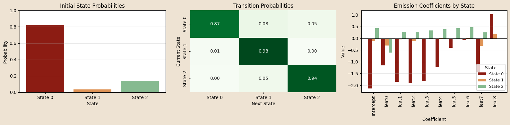
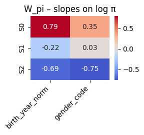
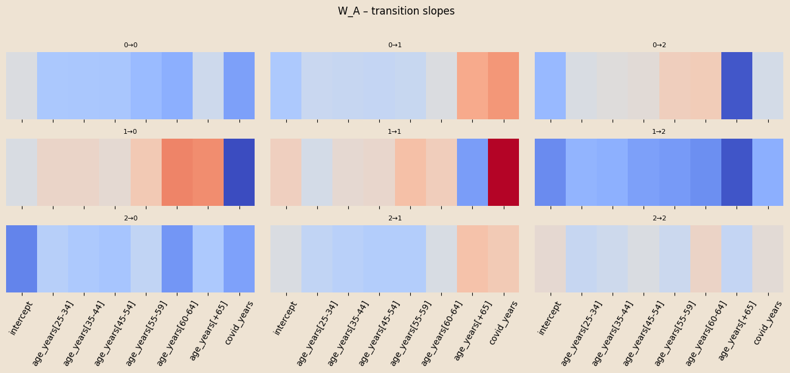
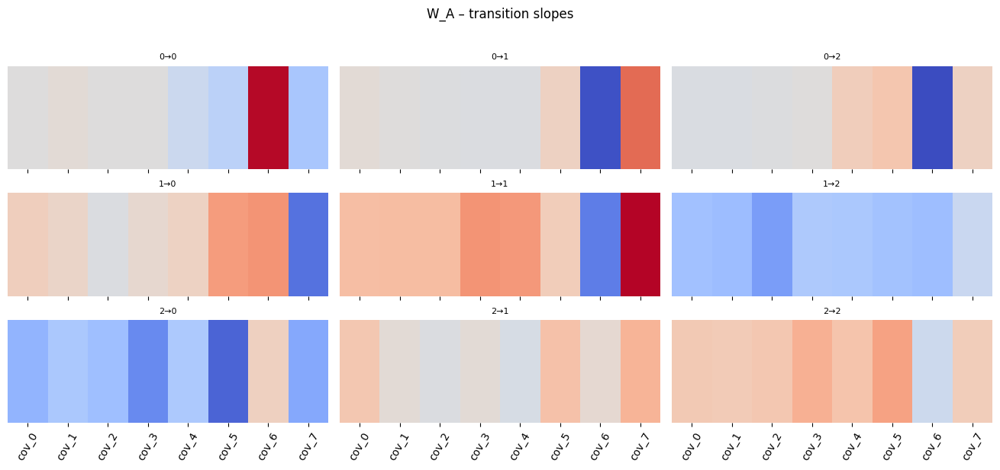

```{python}
#| echo: false
#| include: false
from pyprojroot import here
import sys

python_dir = str(here("python"))
if python_dir not in sys.path:
    sys.path.insert(0, python_dir)

%load_ext autoreload
%autoreload 2
```

## Summary

-   About the data

-   Bayesian HMM

-   Number of latent states

<!-- - Variational inference -->

-   Viterbi algorithm

-   GLM on emissions

-   Check of the model

-   Dashboard


## About the Data{.incremental}

#### What we have

-   A longitudinal panel of 9,000+ unique blood donors in Trieste
-   Annual counts of donations per donor (0–4 per year), spanning 2009–2023

#### Where it comes from

-   ASUGI transfusion service operational registers
-   Fully anonymised data; available covariates: gender (M/F) and year of birth

#### Objective

-   Build a predictive model for future donation propensity and counts
-   Discover latent behavioural profiles and common temporal patterns
-   Quantify the impact of age, gender, and shocks (e.g., COVID-19) on dynamics <!-- - Provide actionable forecasts for blood supply planning -->

#### Limitations

-   Sparse covariates (only gender and birth year)
-   No clinical or socio-economic info <!-- - Donors may not be Trieste residents; population denominators are estimated externally --> <!-- - Anonymisation prevents registry linkage and cohort enrichment -->


## Bayesian HMM

:::{.incremental}
#### Initial-state distribution ($\pi$):

-   $\pi_{\text{base}}\sim\mathrm{Dirichlet}(\boldsymbol{\alpha}_{\pi})$

-   
$$
    \Pr(z_{n,0}=k\mid x^{\pi}_n)=
    \operatorname{softmax}_k\!\bigl(
    \log\pi_{\text{base},k}+W_{\pi,k}\cdot x^{\pi}_n
    \bigr)
    $$

-   $x^{\pi}_n = (\text{birth_year_norm},\;\text{gender_code})\in\mathbb R^{2}$

#### Transition dynamics ($A$)

-   $A_{\text{base}}[k,\cdot]\sim\mathrm{Dirichlet}(\boldsymbol{\alpha}_{A_k})$

-   $$
    \Pr(z_{n,t}=j\mid z_{n,t-1}=k,\;x^{A}_{n,t})=
    \operatorname{softmax}_j\!\bigl(
     \log A_{\text{base},kj}+W_{A,kj}\cdot x^{A}_{n,t}
    \bigr).
    $$

-   $x^{A}_{n,t} = (\text{ages_norm},\;\text{covid_years})\in\mathbb R^{2}$

#### Emission ($\lambda$):

-   $\lambda_k\sim\mathrm{Gamma}(2,1)$ for $k=0,1,2$

-   
$$
    y_{n,t}\mid z_{n,t}=k\sim\text{Poisson}(\lambda_k)
    $$
:::


## Results




## Number of Latent States

**Goal:** estimate model evidence (Laplace approximation) for differnt values of number of states 


$$ 
\log p(X) \;\approx\; \log p\!\left(X \mid \hat{\theta}_{\text{MAP}}\right) \;+\; \text{Occam factor} 
$$

$$
\text{Occam factor} \;\approx\; -\tfrac{1}{2} M \, \ln N
$$

- Forward algorithm per valutare la likeliood function corrispondente ai parametri appresi 

$$ 
\alpha(z_1) \;=\; p(z_1)\, p(x_1 \mid z_1)
$$

$$
\alpha(z_n) \;=\; p(x_n \mid z_n)\; \sum_{z_{n-1}} \alpha(z_{n-1})\, p(z_n \mid z_{n-1})
\quad\text{per } n = 2,\dots, N.
$$

<!-- :::{.callout-note}
Occam factor
::: -->

# Diagnostics


## Viterbi Algorithm

-   **Goal:** for each donor find the MAP latent path $z_{0:T}^\ast$.

. . .

-   Plug-in parameters (posterior means)\
    $$
    \hat\pi_k = \frac{\alpha_{\pi,k}}{\sum_{j}\alpha_{\pi,j}},\qquad
    \hat A_{kj} = \frac{\alpha_{A_{k j}}}{\sum_{j'}\alpha_{A_{k j'}}},\qquad
    \hat\lambda_k = \frac{\alpha_k}{\beta_k}
    $$

. . .

-   Dynamic programming\
    -   Initial step\
        $$
        \delta_0(k)=\log\hat\pi_k+\log\text{Poisson}(y_0\mid\hat\lambda_k)
        $$

    -   Recursion for $t=1,\dots,T$\
        $$
        \delta_t(j)=\max_k\bigl[\delta_{t-1}(k)+\log\hat A_{k j}\bigr]
                      +\log\text{Poisson}(y_t\mid\hat\lambda_j),
        $$ 
        $$
        \psi_t(j)=\arg\max_k\bigl[\delta_{t-1}(k)+\log\hat A_{k j}\bigr]
        $$

    -   Back-tracking\
        Start with $z_T^\ast=\arg\max_k\delta_T(k)$, then $z_{t-1}^\ast=\psi_t(z_t^\ast)$ for $t=T,\dots,1$.


<<<<<<< HEAD
---

## Forward filtering


<div style="display: flex; gap: 2em;">

<!-- Colonna sinistra: codice -->
<div style="flex: 1;">

=======
## Forward filtering

>>>>>>> 6e61a1019eee81d60730298206876afa3cc4b2df
```{python}

#| eval: false
#| code-line-numbers: "5-9"

# Forward filtering to get alpha_T for prediction
log_alpha = torch.empty(1, T_hist, K, dtype=torch.float32)
log_alpha[:, 0] = log_pi + emis_log[:, 0]

for t in range(1, T_hist):
    x_t = xA_te[:, t, :]
    logits = logA0.unsqueeze(0) + (W_A_t.unsqueeze(0) * x_t[:, None, None, :]).sum(-1)
    log_A  = logits - torch.logsumexp(logits, dim=2, keepdim=True)
    log_alpha[:, t] = torch.logsumexp(log_alpha[:, t - 1].unsqueeze(2) + log_A, dim=1) + emis_log[:, t]

alpha_T = (log_alpha[:, -1] - torch.logsumexp(log_alpha[:, -1], dim=1, keepdim=True)).exp().cpu().numpy()[0]

# Next-year transition and emission
logits_next = np.log(A_base + 1e-30) + np.tensordot(W_A, x_A_next, axes=([2], [0]))
A_next = _softmax_np(logits_next)
p_next = alpha_T @ A_next

lam_next = np.exp(beta_em[:, 0] + (beta_em[:, 1:] @ x_em_next))

# Predictive mixture for next year
expected_next = float((p_next * lam_next).sum())
p0 = float((p_next * np.exp(-lam_next)).sum())
prob_donate_next = 1.0 - p0

from scipy.stats import poisson as _po
pmf0k = np.array([(p_next * _po.pmf(k, lam_next)).sum() for k in range(max_k + 1)], dtype=float)
tail  = float(max(0.0, 1.0 - pmf0k.sum()))
pmf_dict = {str(k): float(pmf0k[k]) for k in range(max_k + 1)}
pmf_dict[f">={max_k+1}"] = tail
```
</div> 

<!-- Colonna destra: formule matematiche -->
<div style="flex: 1;">
<span>
\[
\alpha_0(k) = \pi_k \, p(y_0 \mid z_0=k),\quad
\alpha_t(j) = \sum_{k=1}^{K} \alpha_{t-1}(k) \, A_{kj} \, p(y_t \mid z_t=j)
\]
</span>
</div>

</div>  


$$ 
\psi_t(j)=\arg\max_k\bigl[\delta_{t-1}(k)+\log\hat A_{k j}\bigr]
$$

## Forward filtering

```{python}

#| eval: false
#| code-line-numbers: "13-16"

# Forward filtering to get alpha_T for prediction
log_alpha = torch.empty(1, T_hist, K, dtype=torch.float32)
log_alpha[:, 0] = log_pi + emis_log[:, 0]

for t in range(1, T_hist):
    x_t = xA_te[:, t, :]
    logits = logA0.unsqueeze(0) + (W_A_t.unsqueeze(0) * x_t[:, None, None, :]).sum(-1)  # (1,K,K)
    log_A  = logits - torch.logsumexp(logits, dim=2, keepdim=True)
    log_alpha[:, t] = torch.logsumexp(log_alpha[:, t - 1].unsqueeze(2) + log_A, dim=1) + emis_log[:, t]

alpha_T = (log_alpha[:, -1] - torch.logsumexp(log_alpha[:, -1], dim=1, keepdim=True)).exp().cpu().numpy()[0]  # (K,)

# Next-year transition and emission
logits_next = np.log(A_base + 1e-30) + np.tensordot(W_A, x_A_next, axes=([2], [0]))  # (K,K)
A_next = _softmax_np(logits_next)                                                     # (K,K)
p_next = alpha_T @ A_next                                                             # (K,)

lam_next = np.exp(beta_em[:, 0] + (beta_em[:, 1:] @ x_em_next))                       # (K,)

# Predictive mixture for next year
expected_next = float((p_next * lam_next).sum())
p0 = float((p_next * np.exp(-lam_next)).sum())
prob_donate_next = 1.0 - p0

from scipy.stats import poisson as _po
pmf0k = np.array([(p_next * _po.pmf(k, lam_next)).sum() for k in range(max_k + 1)], dtype=float)
tail  = float(max(0.0, 1.0 - pmf0k.sum()))
pmf_dict = {str(k): float(pmf0k[k]) for k in range(max_k + 1)}
pmf_dict[f">={max_k+1}"] = tail
```

$$
\delta_t(j)=\max_k\bigl[\delta_{t-1}(k)+\log\hat A_{k j}\bigr]
              +\log\text{Poisson}(y_t\mid\hat\lambda_j),
$$ 


## GLM on emissions

**Priors:** the same of the Bayesian HMM.

**Slope parameters to learn**

-   $W_\pi \in \mathbb{R}^{K\times 2}$ (`birth_year_norm`, `gender_code`)

-   $W_A \in \mathbb{R}^{K\times K \times 8}$ (seven age-bin dummies `ages_norm`, `covid_years`)

-   $\beta_{em} \in \mathbb{R}^{K \times (1+9)}$ (`intercept`, `gender_code_tile`, `ages_norm`, `covid_years`)

**Initial-state distribution** 

$$
\Pr(z_{n,0}=k \mid x^\pi_n) =
\mathrm{softmax}_k \big( \log \pi_{\text{base},k} + W_{\pi,k} \cdot x^\pi_n \big)
$$

**Transition distribution** 

$$
\Pr(z_{n,t}=j \mid z_{n,t-1}=k, \ x^A_{n,t}) =
\mathrm{softmax}_j \big( \log A_{\text{base},kj} + W_{A,kj} \cdot x^A_{n,t} \big)
$$

**Emission** (one Poisson GLM for each latent state) 

$$
y_{n,t} \mid z_{n,t}=k \sim \mathrm{Poisson}\Big(
  \exp\Big(
      \beta_{em,k,0}
    + \sum_{m=1}^{9} \beta_{em,k,m} \cdot x^{em}_{n,t,m}
  \Big)
\Big)
$$

## Results


## Coefficients on $\pi$



## Coefficients on $A$



## $\beta$ coefficients 



# Testing

## Train and Test data:

- Split Stratificato

- Si divide il dataset in train (90%) e test (10%).

- La divisione non è casuale pura → si usa stratificazione.

- Le strata = genere × fascia d’età (al tempo 0).

- In ogni gruppo si prende ~10% per il test.

Così train e test hanno distribuzioni simili di genere ed età → test set rappresentativo.

## HMM Forward Prediction with GLM Emission 

# Obiettivo della funzione:

  - ('y_pred_hmm') → numero atteso di donazioni per ciascun individuo nell’anno successivo.
$\textbf{state\_prob}$ → distribuzione sugli stati latenti alla fine dell’anno osservato, usata per calcolare la predizione.

- Inizializzazione della distribuzione sugli stati:

$$
\alpha^{(0)}_n = \text{softmax}\Big(\log \pi_{\text{base}} + x^{(n)}_{\pi} W_\pi^\top \Big), \quad n = 1,\dots,N
$$

- Propagazione in avanti per step futuri:
$$
A^{(n)}_t = \text{softmax}_\text{row}\Big( \log A_{\text{base}} + W_A \cdot x^{(n)}_{A,t} \Big), \quad
        \alpha^{(t+1)}_n = \alpha^{(t)}_n \, A^{(n)}_t
$$

- Emissione Poisson (GLM per stato):
$$
\eta^{(n)}_k = \beta_{k0} + \mathbf{x}^{(n)}_{\text{em},t} \cdot \beta_{k,1:}, \quad
        \lambda^{(n)}_k = \exp(\eta^{(n)}_k)
$$

- Predizione del conteggio atteso:
$$
\mathbb{E}[y^{(n)}_{t+h}] = \sum_{k=1}^K \alpha^{(t+h)}_{n,k} \, \lambda^{(n)}_k
$$


- Risultato finale della funzione:
  $$ 
  \text{y\_expected} = \big(\mathbb{E}[y^{(1)}_{t+h}], \dots, \mathbb{E}[y^{(N)}_{t+h}]\big), \quad
        \text{state\_dist} = \alpha^{(t+h)}_n \text{ per ogni individuo } n
  $$


## Predicting Next-Year Donations with HMM + Covariates

**Obiettivo:**  
Predire la distribuzione di donazioni del prossimo anno per un donatore e decodificare gli stati latenti passati usando un **Hidden Markov Model (HMM)** con emissioni Poisson dipendenti da covariate (GLM).

---

### Input principali
- `birth_year`, `gender`  
- Storico donazioni: `history_years`, `history_counts`  
- Covariate opzionali per emissioni (`x_em_builder`) e transizioni (`x_A_builder`)  
- Anni COVID per indicatore: `covid_years`

---

### Passaggi principali

1. **Preparazione dati e covariate**
   - Normalizzazione di età e anno di nascita
   - Costruzione delle covariate per stati iniziali (`x_pi`), transizioni (`x_A`) ed emissioni (`x_em`)  

2. **Emissioni Poisson**
   - Calcolo delle probabilità logaritmiche delle osservazioni date gli stati (`emis_log`)  
   - Dimensione risultante: `(N=1, T, K)`  

3. **Inizializzazione stati latenti**
   - Logits iniziali `log_pi0` combinando prior `pi_base` e covariate iniziali
   - Normalizzazione con `log_softmax` → probabilità iniziali `log_pi`  

4. **Decodifica Viterbi**
   - Ricerca del percorso di stati più probabile (`v_path`)  
   - Backpointers `psi` per tracciare i percorsi ottimali  

5. **Forward Filtering**
   - Calcolo α_t (probabilità marginale di ogni stato al tempo t)  
   - Normalizzazione → distribuzione sugli stati all’ultimo anno osservato (`alpha_T`)  

6. **Predizione prossimo anno**
   - Transizione verso l’anno successivo usando `A_next`  
   - Emissione Poisson predittiva combinata con probabilità sugli stati  
   - Calcolo:
     - Probabilità di ciascuno stato `p_next`
     - Numero atteso di donazioni `expected_next`
     - Probabilità di almeno una donazione `prob_donate_next`
     - PMF fino a `max_k` con tail `>= max_k+1`

---

### Output
- Sequenza stati passati: `viterbi_states`
- Distribuzione di probabilità del prossimo anno: `next_state_probs`
- Predizione numerica:
  - `expected_next`
  - `prob_donate_next`
  - `pmf_next` (dizionario 0..max_k + tail)


## Dashboard

# Backup

## Model in Pyro

```{python}
#| eval: false
#| code-line-numbers: "|26,30,35-38|27,31,41-45|18-20,38,46"
# ───────────────────────────────────────────────────────────────
#  Poisson-HMM con Dirichlet asimmetriche
# ───────────────────────────────────────────────────────────────
import torch, pyro, pyro.distributions as dist
from   pyro.infer  import SVI, TraceEnum_ELBO, config_enumerate
from   pyro.optim  import Adam

K        = 3
C_pi     = 2        # birth_year_norm , gender_code
C_A      = 2        # ages_norm , covid_years

#  a priori asimmetriche 
alpha_pi = torch.tensor([5., 2., 1.])
alpha_A  = torch.tensor([[6.,1.,1.], 
                         [1.,6.,1.],
                         [1.,1.,6.]])

@config_enumerate
def model(obs, x_pi, x_A):
    N, T = obs.shape

    # 1) Poisson rates
    rates = pyro.param("rates",
                       0.5*torch.ones(K),
                       constraint=dist.constraints.positive)

    # 2) Dirichlet priors 
    pi_base  = pyro.sample("pi_base", dist.Dirichlet(alpha_pi))
    A_base   = pyro.sample("A_base",
                           dist.Dirichlet(alpha_A).to_event(1))     # shape (K,K)

    log_pi_base = pi_base.log()           # (K,)
    log_A_base  = A_base.log()            # (K,K)

    # 3) slope coefficients for covariates 
    W_pi = pyro.param("W_pi", torch.zeros(K, C_pi))
    W_A  = pyro.param("W_A",  torch.zeros(K, K, C_A))

    with pyro.plate("seqs", N):
        # T=0
        logits0 = log_pi_base + (x_pi @ W_pi.T)             # (N,K)
        z_prev  = pyro.sample("z_0",
                              dist.Categorical(logits=logits0),
                              infer={"enumerate": "parallel"})
        pyro.sample("y_0", dist.Poisson(rates[z_prev]), obs=obs[:,0])

        # T>0
        for t in range(1, T):
            x_t   = x_A[:, t, :]                            # (N,2)
            logitsT = (log_A_base[z_prev] +
                       (W_A[z_prev] * x_t[:,None,:]).sum(-1))
            z_t = pyro.sample(f"z_{t}",
                              dist.Categorical(logits=logitsT),
                              infer={"enumerate": "parallel"})
            pyro.sample(f"y_{t}", dist.Poisson(rates[z_t]), obs=obs[:,t])
            z_prev = z_t

# ─────────────────────────────────────────────────────────────
#  GUIDE 
# ─────────────────────────────────────────────────────────────
def guide(obs, x_pi, x_A):
    # pi base
    pi_q = pyro.param(
        "pi_base_map",
        torch.tensor([0.6, 0.3, 0.1]),   
        constraint=dist.constraints.simplex
    )

    # A base
    A_init = torch.eye(K) * (K - 1.) + 1.      # helps the diagonal
    A_init = A_init / A_init.sum(-1, keepdim=True) # softmax, x>o and sum(x)=1

    A_q = pyro.param(
        "A_base_map",
        A_init,
        constraint=dist.constraints.simplex # x>o and sum(x)=1
    )

    # fix new pi_base and A_base for the next training iteration
    # Delta is a trick to fix this values with sample 
    pyro.sample("pi_base", dist.Delta(pi_q).to_event(1))  
    pyro.sample("A_base",  dist.Delta(A_q ).to_event(2))  

# training
pyro.clear_param_store()
svi = SVI(model, guide,
          Adam({"lr": 2e-2}),
          loss=TraceEnum_ELBO(max_plate_nesting=1))

for step in range(800):
    loss = svi.step(obs_torch, cov_init_torch, cov_tran_torch)
    if step % 200 == 0:
        print(f"{step:4d}  ELBO = {loss:,.0f}")
```

## Guide

Point-mass approximation:

-   $q(\pi_{\text{base}})=\delta(\pi_{\text{base}}-\hat\pi)$,

-   $q(A_{\text{base}})=\delta(A_{\text{base}}-\hat A)$.

All $\lambda$, $W_\pi$, $W_A$ are deterministic `pyro.param`s and they are optimized during the training. Discrete states $z_{n,t}$ are enumerated exactly, allowing all possible configurations to be calculated using `TraceEnum_ELBO` (without stochastic approximation).