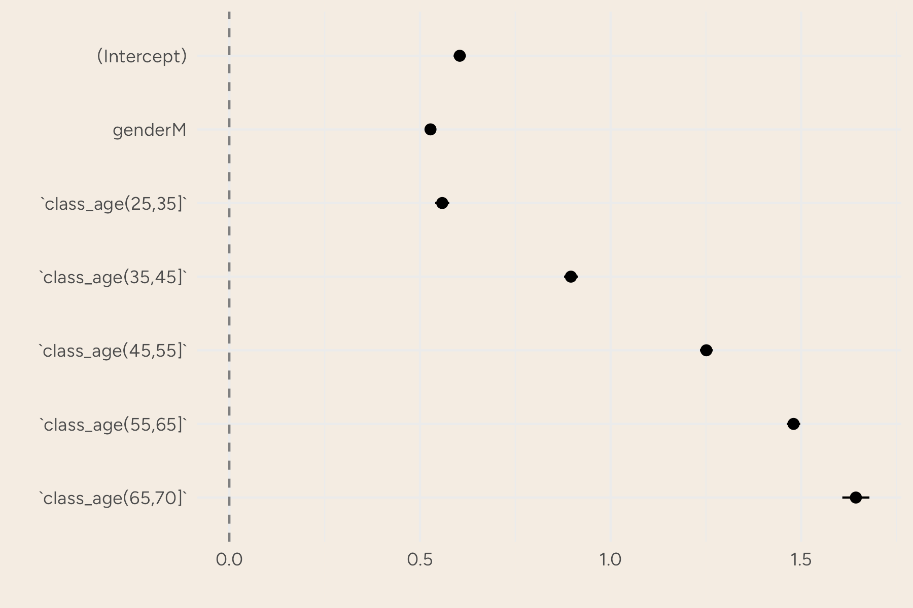
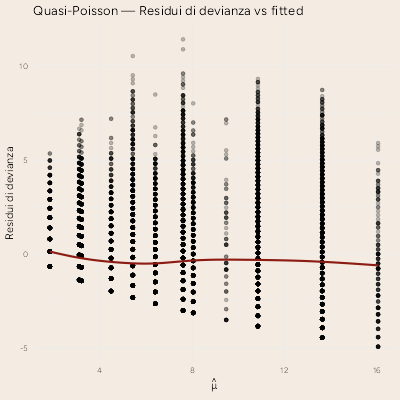
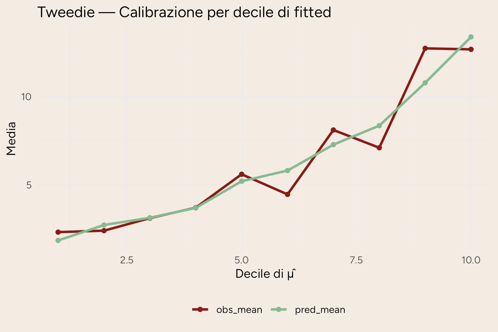
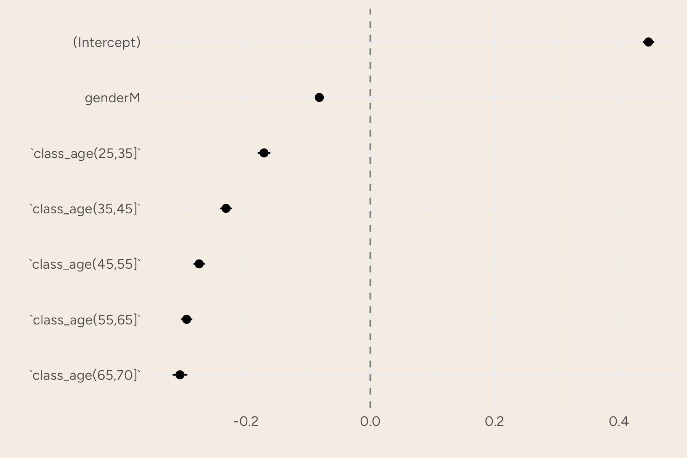
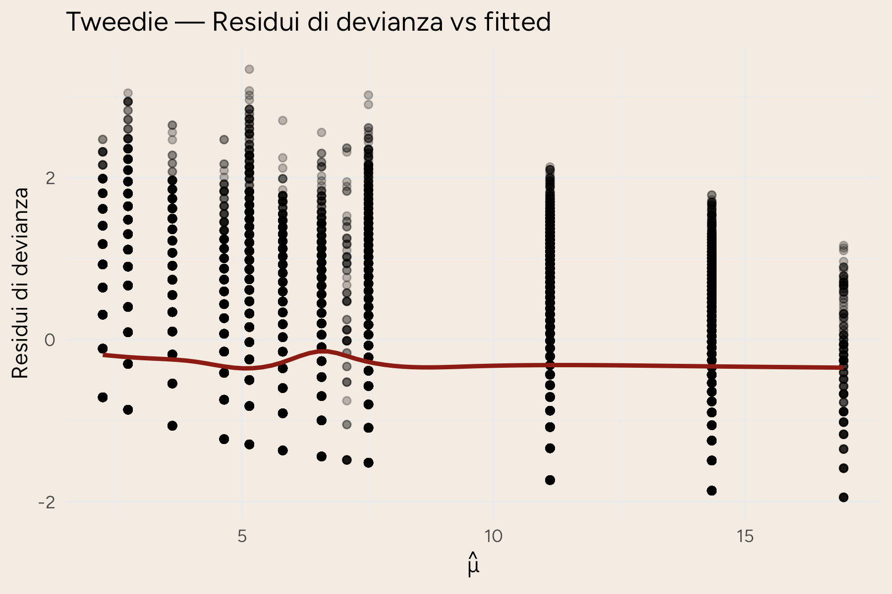

## Teoria dei GLM

I modelli lineari generalizzati, abbreviati GLM, sono un’estensione dei modelli di regressione lineare. 
Per comprendere appieno il significato dei *Generalized Linear Model* si introducono prima i modelli di regressione lineare, i metodi di stima dei coefficienti e gli elementi che li caratterizzano. 
Successivamente si passerà alla loro estensione e all’utilizzo della famiglia esponenziale, citando alcune distribuzioni che saranno poi impiegate nei modelli.

### Regressione Lineare

Un modello statistico è una rappresentazione matematica, e quindi semplificata, del processo che genera i dati. 
La semplificazione passa attraverso assunzioni probabilistiche che rendono esplicito cosa vogliamo descrivere (per esempio la media, la varianza o l’intera distribuzione di una variabile) e in che modo i dati possano essere considerati plausibili sotto tali assunzioni. 
Nel caso della regressione lineare, l’obiettivo è comprendere e quantificare la relazione tra una variabile dipendente $Y$ e una o più variabili esplicative $X$, concentrandosi in particolare su come varia il valore medio di $Y$ al variare di $X$.

::: {.callout-note}
A causa della molteplicità di applicazioni in ambiti diversi, non esiste una terminologia univoca. Nel testo $Y$ sarà anche chiamata variabile dipendente, outcome, output o target; $X$ potrà essere detta variabile indipendente, covariata, feature, predittore o input.
:::

Quando vogliamo modellare la dipendenza media di $Y$ da $X$, introduciamo la funzione di regressione, definita come $m(x) = \mathbb{E}[Y \mid X = x]$. Questa funzione “riassume” il comportamento medio della risposta dato il valore delle covariate. Il modello di regressione lineare assume che tale dipendenza media sia lineare nei parametri: nella regressione lineare semplice (una sola covariata scalare $X$) si postula che
$$
\mathbb{E}[Y \mid X] = \alpha + \beta X,
$${#eq-reg_lin_val_atteso}

dove $\alpha$ è l’intercetta, il valore atteso di $Y$ quando $X=0$, e $\beta$ è il coefficiente di regressione, ovvero quanto ci si attende che $Y$ cambi in media per un incremento unitario di $X$. 
Questa espressione descrive la componente deterministica o sistematica del modello: specifica come si muove la media condizionata di $Y$ quando $X$ varia.
È importante notare che “linearità” qui significa linearità nei parametri: possiamo includere trasformazioni di $X$ (ad esempio $X^2$, $\log X$, ...) e restare dentro il perimetro della regressione lineare, purché i rispettivi coefficienti compaiano linearmente.

Per collegare la media condizionata alla variabilità dei dati reali, aggiungiamo una componente aleatoria.
Il modello stocastico corrispondente scrive la variabile osservata come
$$
Y = \alpha + \beta X + \varepsilon,
$${#eq-mod_lin}

dove $\varepsilon$ è un errore casuale che raccoglie tutto ciò che non è esplicitamente modellato dalla parte sistematica: fattori non osservati, errori di misura, variabilità intrinseca.
La principale assunzione è che l’errore non introduca distorsioni nella media condizionata, cioè che $\mathbb{E}[\varepsilon \mid X] = 0$; in tal modo la relazione @eq-reg_lin_val_atteso rimane valida.
Spesso, per rendere l’inferenza più semplice e precisa, si aggiunge che la varianza degli errori (condizionata a $X$) sia costante, $\mathrm{Var}(\varepsilon \mid X) = \sigma^2\$ (omoschedasticità), e che gli errori siano incorrelati tra osservazioni distinte.
Quando si dispone di un campione $i=1,\dots,n$, queste ipotesi si traducono in $\mathbb{E}[\varepsilon_i \mid X_i]=0$, $\mathrm{Var}(\varepsilon_i \mid X_i)=\sigma^2$ e $\mathrm{Cov}(\varepsilon_i,\varepsilon_j \mid X)=0$ per $i\neq j$.
Un'ulteriore ipotesi, più restrittiva, è che gli errori siano gaussiani: $\varepsilon \mid X \sim \mathcal{N}(0,\sigma^2)$. Questa normalità non è indispensabile per stimare correttamente la media, ma consente risultati esatti in piccoli campioni; in alternativa, si ricorre ad argomentazioni asintotiche o a correzioni robuste della varianza quando l’omoschedasticità o l’indipendenza non sono credibili.

La regressione lineare si estende anche al caso multivariato, in cui $Y$ dipende da più predittori.
Indicando con $x = (1, x_1,\dots,x_p)^\top$ il vettore delle covariate che include un 1 iniziale per l’intercetta e con $\beta = (\alpha,\beta_1,\dots,\beta_p)^\top$ il vettore dei parametri, la componente sistematica diventa $\mathbb{E}[Y \mid X=x] = x^\top \beta$.
L’interpretazione dei coefficienti rimane invariata: $\beta_j$ misura la variazione media di $Y$ associata a un incremento unitario di $X_j$, a parità delle altre covariate.
L’intercetta $\alpha$, invece, rappresenta la media attesa quando tutte le covariate sono poste a zero, interpretazione utile solo se quello zero ha significato nel contesto applicativo.

::: {.callout-note}
È comodo inglobare l’intercetta nella matrice delle covariate aggiungendo una colonna di 1, e scrivere il modello come
$$
Y = X\beta + \varepsilon,\qquad \mathbb{E}[\varepsilon \mid X]=0,\quad \mathrm{Var}(\varepsilon \mid X)=\sigma^2 I.
$$

Qui $Y$ è un vettore $n\times 1$ degli esiti osservati, $X$ è una matrice $n\times (p+1)$ di covariate (con la prima colonna di 1), $\beta$ è il vettore dei parametri e $\varepsilon$ è il vettore degli errori. La condizione di rango pieno di $X$ garantisce l’identificabilità dei coefficienti (assenza di multicollinearità perfetta).
:::

Le ipotesi appena discusse svolgono ruoli distinti.
La media nulla condizionata $\,\mathbb{E}[\varepsilon \mid X]=0\,$ è la chiave per interpretare la parte deterministica come media condizionata e per ottenere stime non distorte dei coefficienti con metodi come i minimi quadrati.
Le ipotesi su varianza costante e indipendenza fra errori, invece, sono cruciali per la validità delle misure di incertezza standard (errori standard, intervalli di confidenza, test) e per l’efficienza degli stimatori classici; quando falliscono (eteroschedasticità, autocorrelazione), si possono ancora stimare correttamente gli effetti medi ma occorre adeguare l’inferenza, ad esempio con errori standard robusti o modelli che esplicitino la struttura di dipendenza.
Infine, l’eventuale normalità degli errori fornisce una comoda idealizzazione: non è la sostanza del modello di regressione lineare, bensì un’ipotesi aggiuntiva che semplifica i calcoli, soprattutto in piccoli campioni.

Quindi, la regressione lineare scompone il fenomeno in una parte deterministica, $x^\top \beta$, che determina la variazione media in base ai predittori, e in una parte aleatoria, $\varepsilon$, che cattura la variabilità non spiegata.

### Metodi di stima {#sec-metodi_stima}

Nel modello lineare classico $Y = X\beta + \varepsilon$ sotto le ipotesi che $\mathbb{E}[\varepsilon]=0$ e $\mathrm{Var}(\varepsilon)=\sigma^2 I$, allora si può usare lo stimatore ai minimi quadrati ordinari (OLS) che minimizza la somma dei quadrati dei residui:
$$
\hat\beta_{\mathrm{OLS}} \;=\; \arg\min_{\beta}\ (Y - X\beta)^\top (Y - X\beta)
\;=\; (X^\top X)^{-1} X^\top Y.
$$

Se si assume in più $\varepsilon \sim \mathcal{N}(0,\sigma^2 I)$, allora $\hat\beta_{\mathrm{OLS}}$ coincide con lo stimatore di massima verosimiglianza (MLE). La funzione di verosimiglianza è
$$
L(\beta,\sigma^2;Y) \;\propto\; (\sigma^2)^{-n/2}
\exp\!\left(-\frac{1}{2\sigma^2}\,(Y-X\beta)^\top (Y-X\beta)\right),
$$

e massimizzarla rispetto a $\beta$ equivale a minimizzare la somma dei quadrati.

:::{.callout-tip}
## Curiosità

Nei GLM la stima avviene per massima verosimiglianza nella famiglia esponenziale. Indicando con $\mu=\mathbb{E}[Y\mid X]$ e con $g(\mu)=\eta=X\beta$ la funzione di collegamento, le equazioni di score portano all’algoritmo IRLS (Iteratively Reweighted Least Squares): a ogni iterazione si risolve un problema di minimi quadrati pesati
$$
\beta^{(t+1)} \;=\; \arg\min_{\beta}\ \big\|W^{1/2}\,(z - X\beta)\big\|^2,
$$

dove $W$ è una matrice di pesi dipendente da $\mu^{(t)}$ e $z$ è la “variabile dipendente lavorata” (working response). La convergenza fornisce $\hat\beta_{\mathrm{MLE}}$.
:::

<!-- 
La dispersione $\phi$ è:
- fissata per Binomiale e Poisson ($\phi=1$),
- stimata per Quasi-likelihood e per famiglie con parametro di dispersione (es. Gamma, Inverse-Gaussian) tramite, ad esempio, la devianza residua o la statistica di Pearson:
$$
\hat\phi_{\mathrm{Pearson}}
\;=\; \frac{1}{n-p}\,\sum_{i=1}^n \frac{(y_i-\hat\mu_i)^2}{V(\hat\mu_i)},
$$

dove $V(\mu)$ è la funzione di varianza del modello. -->

### Estensione della Regressione Lineare


Il GLM si compone di tre elementi:

- componente aleatoria: $Y_i \mid X_i \sim \text{famiglia esponenziale}(\mu_i,\phi)$;

- componente sistematica: $\eta_i = x_i^\top\beta${#eq-eta};

- funzione di collegamento: $g(\mu_i)=\eta_i${#eq-link_function}.

Il collegamento canonico rende lineare il parametro naturale (es. logit per Binomiale, log per Poisson, inversa per Gamma). Ogni famiglia è caratterizzata da una funzione di varianza $V(\mu)$ che determina la struttura di dispersione: $\,\mathrm{Var}(Y_i\mid X_i)=\phi\,V(\mu_i)$.

La qualità di adattamento si valuta tramite devianza, AIC/BIC e diagnostiche dei residui. La scelta di famiglia e link è guidata dalla natura della risposta (discreta/continua, supporto, presenza di zeri) e dall’interpretabilità dei coefficienti.

La funzione di regressione lineare è lineare rispetto ai parametri $\beta$ in @eq-eta, anche se la relazione tra $X$ e $Y$ non deve necessariamente essere lineare. La differenza tra gli LM e i GLM è proprio la funzione di collegamento @eq-link_function, che nei modelli lineari non sarebbe altro che la funzione identità, ovvero $g(\mu_i) = \mu_i$.

### Famiglia Esponenziale {#sec-esponenziale}

Nei modelli lineari generalizzati (GLM), la variabile dipendente $Y$ è modellata seguendo una distribuzione appartenente alla famiglia esponenziale. Una distribuzione è parte della famiglia esponenziale se la sua funzione di densità di probabilità (o funzione di massa di probabilità, nel caso discreto) può essere espressa nella forma:

$$
f_Y(y|\theta, \phi) = \exp\left(\frac{y \theta - b(\theta)}{\phi} + c(y, \phi)\right)
$$

dove:

- $\theta$ è il parametro naturale della distribuzione,

- $\phi$ è il parametro di dispersione,

- $b(\theta)$ è una funzione che determina la forma della distribuzione,

- $c(y, \phi)$ è una funzione che non dipende da $\theta$.

Questa forma generale include molte distribuzioni comuni, come:

1. **Distribuzione Normale**: 
   - $Y \sim \mathcal{N}(\mu, \sigma^2)$
   - Forma esponenziale: $\theta = \mu$, $\phi = \sigma^2$, $b(\theta) = \frac{\theta^2}{2}$, $c(y, \phi) = -\frac{y^2}{2\phi} - \frac{1}{2}\log(2\pi\phi)$.

2. **Distribuzione Binomiale**:
   - $Y \sim \text{Binomiale}(n, p)$
   - Forma esponenziale: $\theta = \log\left(\frac{p}{1-p}\right)$, $\phi = 1$, $b(\theta) = n \log(1 + e^\theta)$, $c(y, \phi) = \log\left(\binom{n}{y}\right)$.

3. **Distribuzione Poisson**:
   - $Y \sim \text{Poisson}(\lambda)$
   - Forma esponenziale: $\theta = \log(\lambda)$, $\phi = 1$, $b(\theta) = e^\theta$, $c(y, \phi) = -\log(y!)$.

Queste distribuzioni permettono di modellare variabili dipendenti $Y$ che non sono normalmente distribuite, ampliando le applicazioni dei GLM rispetto ai modelli di regressione lineare tradizionali. La scelta della distribuzione appropriata dipende dalla natura dei dati e dal tipo di variabile dipendente che si sta modellando.

Nei modelli lineari generalizzati (GLM), la funzione di collegamento (*link function*) $g(\cdot)$ stabilisce una relazione tra il valore atteso della variabile dipendente $Y$, denotato come $E[Y|X]$, e una combinazione lineare delle variabili indipendenti. Questa relazione è espressa come:

$$
g(E[Y|X]) = \eta = \beta_0 + \beta_1 X_1 + \beta_2 X_2 + \ldots + \beta_p X_p
$$

dove $\eta$ è il predittore lineare, $\beta_0$ è l'intercetta, e $\beta_1, \beta_2, \ldots, \beta_p$ sono i coefficienti di regressione associati alle variabili indipendenti $X_1, X_2, \ldots, X_p$.

La funzione di collegamento $g(\cdot)$ permette di modellare relazioni non lineari tra $X$ e $Y$, trasformando il valore atteso di $Y$ in modo che possa essere espresso come una combinazione lineare delle variabili indipendenti. Ad esempio, nel caso di una regressione logistica, la funzione di collegamento è il logit, definito come:

$$
g(E[Y|X]) = \log\left(\frac{E[Y|X]}{1 - E[Y|X]}\right)
$$

Questa trasformazione consente di modellare la probabilità che $Y$ assuma un certo valore in funzione delle variabili indipendenti, pur mantenendo la linearità nei parametri.[@statistical_learning]


## Modello Esplicativo

L’analisi esplicativa utilizza, per ciascun donatore, il conteggio totale di donazioni accumulate nel periodo 2009–2023 come variabile risposta discreta $Y_i=\text{total\_donations}_i$. Le covariate includono la classe d'età (all’ultimo anno osservato), anno della prima donazione e genere. 
Per limitare l’influenza di outlier rari si esclude la coda estrema ($Y_i<100$) e si considerano solo i donatori *attritional*, coerentemente con i vincoli clinici annui e con la cadenza osservativa. 

<!-- 
$$
Y_i \;{\buildrel d\over\sim}\; \text{Dist}\bigl(\mu_i,\phi\bigr)
\quad
\log \mu_i
  = \beta_0
  + \beta_1\,\text{age}_i
  + \beta_2\,\text{gender}_i
  + \beta_3\,(\text{age}_i)^2
  + \beta_5\,\text{first\_donation\_year}_i
$$
 -->

### Quasi-Poisson

#### Teoria del quasi-Poisson

La teoria del quasi-Poisson è un'estensione del modello di regressione di Poisson utilizzata nei modelli lineari generalizzati (GLM) per gestire dati di conteggio che mostrano overdispersione. L'overdispersione si verifica quando la varianza dei dati è maggiore della media, una situazione che il modello di Poisson standard non può gestire poiché assume che la varianza sia uguale alla media.

Nel modello di Poisson standard, la distribuzione di $Y$ è definita come:

$$
Y \sim \text{Poisson}(\lambda)
$$

dove $\lambda$ è il parametro di intensità, e la varianza è uguale alla media: $Var(Y) = E[Y] = \lambda$.

Nel modello quasi-Poisson, invece, la varianza è proporzionale alla media, ma con un fattore di dispersione $\phi$:

$$
Var(Y) = \phi \cdot \lambda
$$

dove $\phi$ è il parametro di dispersione che permette di modellare l'overdispersione. Quando $\phi > 1$, indica che c'è overdispersione nei dati.

La funzione di collegamento nel modello quasi-Poisson è la stessa del modello di Poisson, tipicamente il logaritmo naturale:

$$
g(E[Y|X]) = \log(\lambda) = \eta = \beta_0 + \beta_1 X_1 + \beta_2 X_2 + \ldots + \beta_p X_p
$$

Il modello quasi-Poisson utilizza la stessa struttura lineare per il predittore $\eta$, ma permette una varianza maggiore rispetto alla media, fornendo una maggiore flessibilità nel modellare dati di conteggio che non seguono strettamente la distribuzione di Poisson.

#### Risultati

Nel nostro dataset la dispersione stimata risulta nettamente maggiore di 1, evidenziando overdispersione marcata rispetto al Poisson puro. 
A parità di link (log) i coefficienti mostrano pattern interpretabili: un effetto medio decrescente dell’età (attenuato nelle classi centrali quando si usa la categorizzazione), e un incremento significativo per i donatori abituali rispetto ai non periodici.
Le incertezze correttamente "allargate" da $\hat\phi$ evitano eccessi di significatività dovuti alla varianza sottostimata dal Poisson.

```{r}
#| tbl-cap: Coefficienti del modelli di Quasi-Poisson
#| label: tbl-coeff_quasipoisson
readRDS(here::here("R/fit_qpois_wf.rds")) |>
   gtsummary::tbl_regression()
```

{#fig-qp_coeff}

{#fig-qp_res}

### Tweedie _(power $\sim$ 1.19)_

#### Teoria della Tweedie

Il modello Tweedie è un tipo di modello lineare generalizzato (GLM) che gestisce dati che possono avere una distribuzione di probabilità con una combinazione di caratteristiche di distribuzioni di Poisson e gamma. È particolarmente utile per modellare dati che includono valori zero e continui positivi, come i dati di assicurazione che comprendono sinistri con importi variabili.

##### Caratteristiche del Modello Tweedie

Il modello Tweedie appartiene alla famiglia esponenziale e si caratterizza per avere una funzione di varianza della forma:
$$
Var(Y) = \phi \cdot \mu^p
$$
dove:

- $\mu = E[Y]$ è il valore atteso,

- $\phi$ è il parametro di dispersione,

- $p$ è il parametro di potenza che determina la forma della distribuzione.

##### Differenze rispetto al Quasi-Poisson

Il modello quasi-Poisson, come discusso in precedenza, assume che la varianza sia proporzionale alla media ($Var(Y) = \phi \cdot \lambda$), il che è utile per gestire l'overdispersione nei dati di conteggio.

Il modello Tweedie, invece, generalizza ulteriormente questa relazione introducendo il parametro di potenza $p$, che permette di modellare una gamma più ampia di distribuzioni:

- **$p = 1$**: corrisponde al modello di Poisson, dove la varianza è uguale alla media.

- **$p = 2$**: corrisponde al modello gamma, utilizzato per dati continui positivi.

- **$1 < p < 2$**: rappresenta una distribuzione Tweedie, che combina caratteristiche di Poisson e gamma, utile per dati con valori zero e continui positivi. Verrà utilizzata successivamente. 
<!-- TODO: inserire link capitolo tweedie -->

##### Funzione di Collegamento

Come nei modelli GLM, il modello Tweedie utilizza una funzione di collegamento per stabilire la relazione tra il valore atteso e una combinazione lineare delle variabili indipendenti:

$$
g(E[Y|X]) = \eta = \beta_0 + \beta_1 X_1 + \beta_2 X_2 + \ldots + \beta_p X_p
$$

La scelta della funzione di collegamento dipende dalla natura dei dati e dal valore del parametro di potenza $p$.

#### Tuning del parametro $p$

<!-- spiegazione di come funziona il tuning -->

#### Risultati

Il tuning del parametro di potenza suggerisce $p \approx 1.19$, collocando la risposta tra Poisson e Gamma. A parità di specifica, la devianza/AIC risultano favorevoli al Tweedie rispetto al quasi-Poisson, segno che la legge di varianza $\mu^p$ cattura meglio l’eteroschedasticità e la struttura della coda. I coefficienti mantengono interpretazione su scala log-tasso, con pattern coerenti a quelli osservati nel quasi-Poisson.

{#fig-tw_decile}

### Gamma

#### Teoria della distribuzione Gamma

Il modello gamma è utilizzato per modellare variabili dipendenti che sono continue e positive. È particolarmente utile per dati che rappresentano tempi di attesa, costi, o altre misure che non possono assumere valori negativi.

##### Caratteristiche del Modello Gamma

La distribuzione gamma è parte della famiglia esponenziale e ha una funzione di densità di probabilità definita come:

$$
f_Y(y|\alpha, \beta) = \frac{\beta^\alpha}{\Gamma(\alpha)} y^{\alpha-1} e^{-\beta y}
$$

dove:

- $\alpha$ è il parametro di forma,

- $\beta$ è il parametro di scala,

- $\Gamma(\alpha)$ è la funzione gamma.

Nel contesto dei GLM, la varianza della distribuzione gamma è proporzionale al quadrato della media:

$$
Var(Y) = \phi \cdot \mu^2
$$

dove $\mu = E[Y]$ è il valore atteso e $\phi$ è il parametro di dispersione.

##### Funzione di Collegamento

Il modello gamma utilizza una funzione di collegamento per stabilire la relazione tra il valore atteso e una combinazione lineare delle variabili indipendenti. Una scelta comune per la funzione di collegamento nel modello gamma è il logaritmo naturale:

$$
g(E[Y|X]) = \log(\mu) = \eta = \beta_0 + \beta_1 X_1 + \beta_2 X_2 + \ldots + \beta_p X_p
$$

Questa funzione di collegamento è appropriata perché garantisce che il valore atteso $\mu$ sia sempre positivo, riflettendo la natura dei dati modellati.

Tuttavia la sua funzione di collegamento canonica sarebbe la funzione inversa.

#### Risultati

La distribuzione Gamma, essendo una distribuzione continua e positiva, non è teoricamente ideale per modellare le donazioni di sangue, che sono dati discreti e limitati nell'intervallo $[0,4]$. In teoria, una distribuzione discreta, come la binomiale, potrebbe essere più appropriata per rappresentare questo tipo di dati, ma nella sua applicazione ha dato scarsi risultati.

Infatti, la distribuzione Gamma offre una notevole flessibilità, a differenza della binomiale, grazie ai suoi iperparametri, che permettono di adattare la forma della distribuzione alle caratteristiche specifiche dei dati. Questa capacità di adattamento può risultare vantaggiosa in pratica, consentendo di ottenere un buon fit dei dati osservati, anche se la distribuzione non corrisponde perfettamente alla natura discreta delle donazioni di sangue.

Mentre la scelta della distribuzione Gamma potrebbe non essere teoricamente perfetta per dati discreti e limitati, la sua capacità di adattarsi bene ai dati grazie alla flessibilità dei suoi iperparametri la rende una scelta pratica in molti contesti.

{#fig-gamma_coeff}

{#fig-gamma_res}

<!-- Usato con link inverso per controllare la varianza; peggiora drasticamente Df-LogLik (–12 %) -> non adatto a fenomeni discretizzati con molti zeri. -->

## Modello Predittivo

<!-- descrivere come è stato strutturato il dataset, analizzando le differenze con quello precedente -->

La densità Gamma in parametrizzazione shape–rate è
$$
f_Y(y\mid \alpha,\beta) \;=\; \frac{\beta^\alpha}{\Gamma(\alpha)}\,y^{\alpha-1}e^{-\beta y},\qquad y>0,
$$
dove $\alpha$ è il parametro di forma e $\beta$ il parametro di tasso (rate). In parametrizzazione shape–scale $\theta=1/\beta$ si ha $\,f(y)=\frac{1}{\Gamma(\alpha)\theta^\alpha}y^{\alpha-1}\exp(-y/\theta)$.

Nel GLM Gamma vale $\,\mathrm{Var}(Y)=\phi\,\mu^2\,$ e il link canonico è l’inverso $\,g(\mu)=1/\mu\,$ (il link log è spesso preferito per interpretabilità moltiplicativa e positività di $\mu$).
