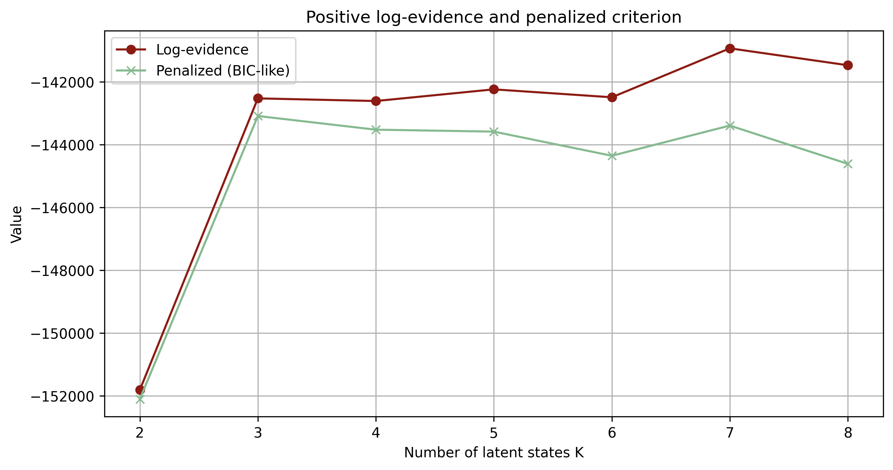
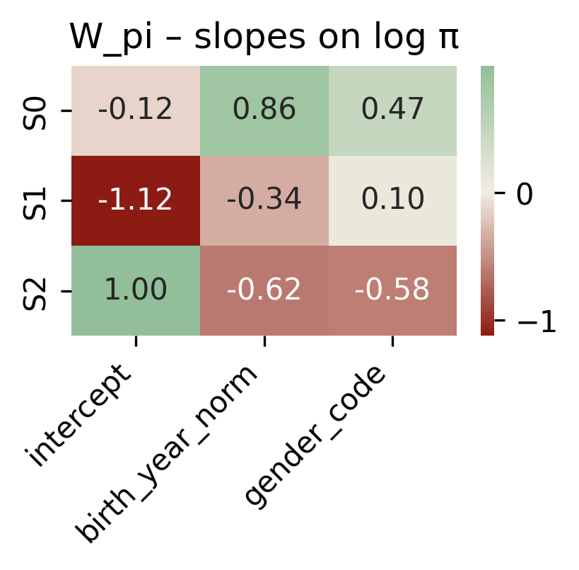
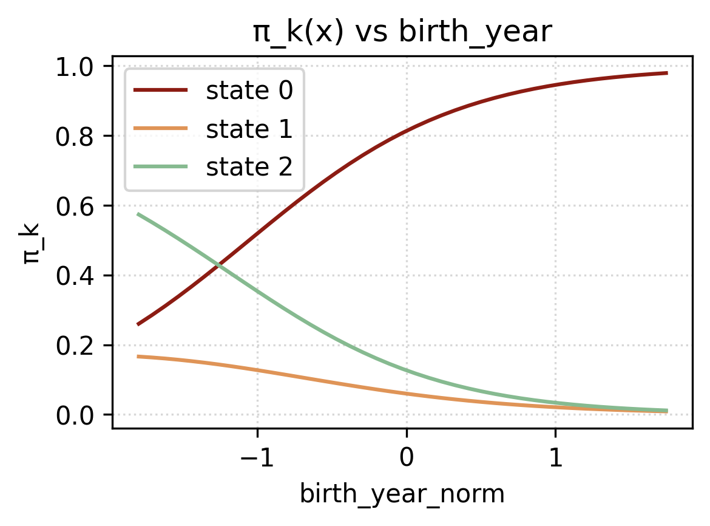
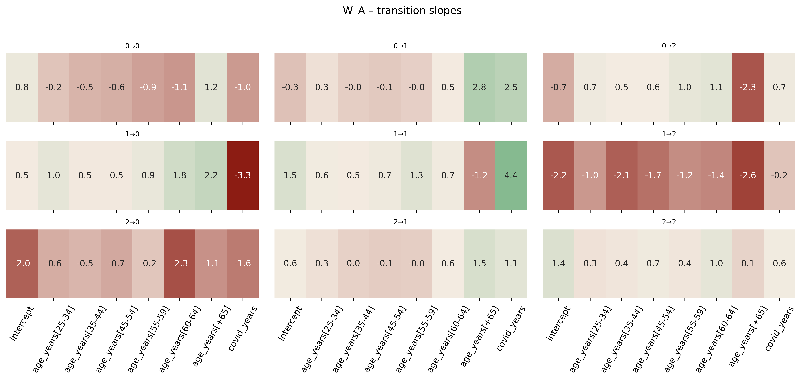
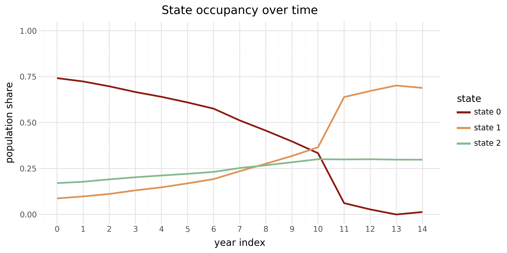

```{python}
#| include: false
#| echo: false
from pyprojroot import here
import sys

python_dir = str(here("python"))
if python_dir not in sys.path:
    sys.path.insert(0, python_dir)

%load_ext autoreload
%autoreload 2
```

## Accenni di Teoria

### Processo Markoviano

Un processo stocastico è una collezione di variabili aleatorie indicizzate da un parametro, tipicamente il tempo, che può essere continuo o discreto ma con la condizione che sia equidistante. La sequenza si denota come $\{X_t\}_{t \ge 1}$. Le variabili aleatorie possono essere continue o discrete e possono essere correlate tra loro. Questa dipendenza caratterrizza alcune delle proprietà che il processo può assumere come la stazionarietà, l'indipendenza o la correlazione. Queste proprietà possono definire categorie di processi stocastici, ad esempio i processi di Poisson sono caratterizzati da eventi che si verificano in modo indipendente e i processi stazionari spmp caratteroszati da proprietà statiche, che non cambiano nel tempo.

Un processo stocastico è una collezione di variabili aleatorie indicizzate da un parametro (tipicamente il tempo). Nel caso discreto a passi equispaziati, la sequenza si denota come $\{X_t\}_{t \ge 1}$. Un processo è markoviano di ordine 1 se il futuro dipende dal presente ma non dal passato più remoto.

::: {layout-align="center"}
```{mermaid}
graph LR
    X1(("$$X_1$$")) --> X2(("$$X_2$$"))
    X2 --> dots(("..."))
    dots --> Xn(("$$X_n$$"))
```
:::

Il processo markoviano è un caso specifico dei processi stocastici, e in questo caso la proprietà principale è che lo stato futuro dipende solamente dal suo presente e non dal passato. L'ipotesi assuntiva è molto forte e permette di semplificare drasticamente un modello di serie storiche. Infatti non servirà più osservare l'intero passato per predire il futuro, ma basterà appena avere le informazione sullo stato precedente. Ciò si basa su proprietà base della probabilità, nel caso di un processo markoviano di primo ordine, l'osservazione successiva dipenderà solamente dalla precedente:

::: {#def-markov .definition}
## Proprietà di Markov

Sia $\{X_t\}$ un processo stocastico. Allora $\{X_t\}$ è markoviano di ordine 1 se e solo se 
$$
\Pr(X_t \mid X_{t-1},\dots,X_1)  =  \Pr(X_t \mid X_{t-1}) \qquad t \ge 2.
$$
:::

Per la @def-markov, tutte le future donazioni sono indipendenti da quelle passate, ad eccezione di $k$ osservazion più recenti, dove $k$ è il grado della catena markoviana: $x_{n+1} \perp x_{n-1} | x_n$.

Una catena di Markov omogenea (stazionaria nel tempo) è caratterizzata da:

-   la matrice di transizione $\mathbf{A}$ con elementi $a_{ij} = \Pr(X_t = j \mid X_{t-1} = i)$, per $t \ge 2$;

-   il vettore di probabilità iniziali $\boldsymbol{\pi}$ con $\pi_i = \Pr(X_1 = i)$;

-   lo spazio degli stati finiti $Z = \{1,\dots,K\}$.

#### Proprietà strutturali

Di seguito alcune proprietà importanti che verrano usate in seguito per la descrizione e definizione degli Hidden Markov Model in generale e di quello specificatamente utilizzato nel progetto.

::: {#def-ergodicity .definition}
## Ergodicità (catene omogenee)

Sia $\{X_t\}_{t\ge 0}$ una catena di Markov a tempo discreto su spazio degli stati finito $Z$ con matrice di transizione $\mathbf{A}$ (costante nel tempo). Se la catena è irriducibile, aperiodica e positivamente ricorrente, allora esiste ed è unica una distribuzione stazionaria $\boldsymbol{\pi}^*$ tale che $\boldsymbol{\pi}^* \mathbf{A} = \boldsymbol{\pi}^*$. @levin2009.
:::

Il tempo di mixing misura quanto rapidamente la distribuzione della catena "dimentica" le condizioni iniziali e si avvicina a $\boldsymbol{\pi}^*$.

::: {#def-homogeneous .definition}
## Catena di Markov omogenea nel tempo

Una catena di Markov discreta $\{X_t\}_{t \ge 0}$ su spazio degli stati finito $Z$ si dice omogenea (o stazionaria nel tempo) se esiste una matrice di transizione costante $\mathbf{A}$ tale che, per ogni $t \ge 1$ e per ogni $i,j \in Z$, 
$$
\Pr(X_t = j \mid X_{t-1} = i) = A_{ij},
$$ 
ossia le probabilità di transizione non dipendono dal tempo. Una distribuzione $\boldsymbol{\pi}$ si dice stazionaria se soddisfa 
$$
\boldsymbol{\pi}\,\mathbf{A} = \boldsymbol{\pi}, \qquad \boldsymbol{\pi}\,\mathbf{1} = 1,\ \ \boldsymbol{\pi}\!\ge\! \mathbf{0}.
$$
:::

Una catena, invece, è detta non omogenea se la transizione al tempo $t$ è data da una matrice $\mathbf{A}_t$ che può dipendere da $t$ o da covariate $x_t$, cioè $\mathbf{A}_t=\mathbf{A}(x_t)$. In generale:

-   non esiste una distribuzione stazionaria unica (indipendente dal tempo) che soddisfi $\boldsymbol{\pi}\,\mathbf{A}_t=\boldsymbol{\pi}$ per tutti i $t$;

-   si usa la nozione di "ergodicità debole": le distribuzioni indotte da condizioni iniziali diverse si avvicinano tra loro sotto opportune condizioni di contrazione.

### Hidden Markov Models (HMM)

Come citato nel capitolo precedente, le catene markoviano sono molto utili perché riescono a riassumere tutta la storia passata con appena $k$ passi precedenti, dove $k$ è l'ordine della catena markoviana. Quest'ipotesi permette di ridurre la fattorizzazione passando da 
$$
Pr(x_1, \dots, X_N) = Pr(x_1)Pr(x_2|X_1)Pr(x_3|x_2,X_1)\dots Pr(x_n+1|x_n,\dots, x_{n-k+1})\dots
$$ 

In questo modo il modello è computazionalmente efficiente in quanto ha bisogno di processare molta meno informazione.

Tuttavia, ciò non permette di modellare strutture più complesse, e in questo caso bisogna raggirare la proprietà di Markov (@def-markov). Si introducono quindi delle variabili latenti, delle variabili nascoste (*hidden*), che non sono osservate. Vengono costituiti due stage/serie dipendenti tra loro. La prima serie è costituita da una catena markoviana di variabili latenti, $Z_t$ al tempo $t$, che non possiamo osservare e che dipendono solo dallo stato precedente, $Z_{t-1}$ allo stato $t-1$. La seconda serie, invece, sono le variabili osservate, e la loro emissione (distribuzione) dipende dallo stato latente.

<!-- Gli HMM introducono variabili latenti $Z_t$ non osservate e variabili osservate $Y_t$ (emissioni). L'evoluzione latente $\{Z_t\}$ segue una catena di Markov, mentre $Y_t$ dipende solo da $Z_t$:

- Stati: $Z_t \mid Z_{t-1} \sim \text{Categorical}(\mathbf{A}[Z_{t-1}, \cdot])$.

- Emissioni: $Y_t \mid Z_t = k \sim f(\cdot \mid \phi_k)$. -->


Con parametri $\theta = (\boldsymbol{\pi}, \mathbf{A}, \boldsymbol{\phi})$ la fattorizzazione congiunta è: 
$$
\Pr(\mathbf{y}, \mathbf{z} \mid \theta)
= \Pr(z_1 \mid \boldsymbol{\pi}) \,\prod_{t=2}^{T} \Pr(z_t \mid z_{t-1}, \mathbf{A}) \,\prod_{t=1}^{T} \Pr(y_t \mid z_t, \boldsymbol{\phi}).
$$

In aggiunta gli HMM permettono di modellare non solo una sequenza ma anche molteplici.

#### Estensioni degli HMM

Gli Hidden Markov Model possono essere estesi a problemi più generalizzati. Si possono quindi rompere o adattare alcune parti della sua struttura, come la matrice di transizione e le probabilità di emissione. Facendo ciò si aumenta il grado di complessità del modello perdendo leggermente la sua facile intuitività. Ma allo stesso tempo si vanno a migliorare notevolmente le sue prestazioni e la sua adattabilità al mondo reale. Di seguito vengono riportate alcune delle estensioni che verranno poi implementato nel modello predittivo.

##### Emissioni flessibili {#sec-emissioni-flessibili}

Secondo @fan2015, dato un HMM del primo ordine e che sia almeno ergodico (@def-ergodicity), allora si può definire una famiglia esponenziale per la distribuzione condizionata alle osservazioni, ovvero la distribuzione delle emissioni. Normalmente le emissioni sono dei parametri della distribuzione di Poisson, $\lambda$, e della distribuzione Gaussiana, $\mu$ o $\sigma$. In questo caso si andrebbe ad estendere il problema e si ipotizza una famiglia esponenziale (vedi @sec-esponenziale), che racchiude sia la distribuzione Poisson che la Gaussiana. I parametri della famiglia esponenziale, o della distribuzione scelta, non dipenderebbero unicamente dallo stato latente, ma, dipenderebbero da dei coefficienti $\beta_k$ e da delle covariate $W_{t}$. Le covariate sono note, e possono cambiare nel tempo, permettendo al modello una flessibilità temporale garantendo la stazionarietà, nel caso in non venisse implementato un sistema di covariate come si vedrà nella sezione successiva. I parametri da stimare diventano, quindi, i $\beta_k$, e il loro valore sarà condizionato allo stato latente. Di conseguenza, si produrrano $K$ GLM dove $K$ è il numero di stati latenti.

##### Non omogeneità

Per aumentare le performance del modello o per studiare a fondo le dinamiche che possono influire nel cambio di stato, allora può essere interessante aggiungere delle covariate nella matrice di transizione. Il processo è simile a quello descritto nella sezione precedente (vedi @sec-emissioni-flessibili), tuttavia in questo caso non garantiremmo più la proprietà di omogeneità (vedi @def-homogeneous).

### Bayesiana

<!-- parlare dello di Scott et al. 2005 longitudinal health study HMM with dirichlet -->

### Teoria dell’algoritmo di Viterbi (caso generale) {#sec-teoria_viterbi}

Nel caso classico di HMM con distribuzione iniziale $\boldsymbol{\pi}$, matrice di transizione $\mathbf{A}$ ed emissioni $b_j(y_t)=\Pr(y_t\mid z_t{=}j)$, l’algoritmo di Viterbi cerca il percorso a *Maximum A Posteriori* (MAP) $z_{0:T}^\star=\arg\max_{z_{0:T}}\Pr(z_{0:T}\mid y_{0:T})$.
L’idea è trasformare questo problema globale in una sequenza di passi locali grazie alla programmazione dinamica: invece di tenere traccia di tutti i cammini possibili, si propaga nel tempo, per ciascuno stato $j$, il valore della “miglior” probabilità cumulativa che termina in $j$.

<!-- spiegare la differenza tra max-plus e sum-product -->

Per stabilità numerica si lavora in log-spazio.
Si definisce quindi $\delta_t(j)$ come il massimo, tra tutti i cammini che arrivano a $t$ in $j$, della log-probabilità congiunta fino a $t$. L’inizializzazione è immediata:
$$
\delta_0(j)=\log \pi_j+\log b_j(y_0),
$$

che combina la probabilità di partire nello stato $j$ con la verosimiglianza dell’osservazione iniziale. Il passo ricorsivo somma l’evidenza al tempo $t$ alla migliore prosecuzione dal tempo precedente:
$$
\delta_t(j)=\log b_j(y_t)+\max_k\bigl\{\delta_{t-1}(k)+\log A_{k j}\bigr\}.
$$

Per ricostruire il percorso, oltre ai valori $\delta_t$ si memorizzano i “backpointer” $\psi_t(j)$, cioè l’indice $k$ che massimizza l’espressione tra graffe.
Al termine, si sceglie $z_T^\star=\arg\max_j \delta_T(j)$ e si risale a ritroso con $z_{t-1}^\star=\psi_t(z_t^\star)$ fino a $t=1$.
In altre parole, Viterbi calcola in avanti i punteggi ottimali e, alla fine, riassembla all’indietro il cammino MAP.

Dal punto di vista computazionale, Viterbi è lineare nella lunghezza della sequenza e quadratico nel numero di stati, con complessità $\mathcal{O}(T\,K^2)$ e memoria $\mathcal{O}(T\,K)$ (per i backpointer). In implementazione conviene usare sistematicamente la forma log e la “log-sum-exp trick” quando servono normalizzazioni, così da evitare underflow e garantire stabilità. 

I motivi per preferirlo sono pratici oltre che teorici: restituisce un percorso ottimale globale rispetto alla perdita 0–1 sulla sequenza intera ed è efficiente anche su serie lunghe.
Inoltre, è stabile numericamente grazie al lavoro in log ed è soprattutto deterministico e facilmente interpretabile, qualità preziose per analisi più approfondite e successive personalizzazioni.
Infine, si adatta senza sforzo a contesti non omogenei o con covariate, come nel nostro HMM-GLM, perché la dinamica ricorsiva resta invariata e cambia soltanto la parametricità di $\pi$, $A$ ed emissioni.

## Il modello applicato alle donazioni

### Pyro {#sec-pyro}

Dopo la parte teorica, in questo capitolo parleremo della applicazione della teoria ai dati sulle donazioni di sangue. Se nel precedentemente capitolo era stato utilizzato quasi totalmente il linguaggio di programmazione statistica R, e i pacchetti `tidyverse` e `tidymodels`, in questo capitolo i modelli verranno sviluppati attraverso il linguaggio di programmazione python e il pacchetto `Pyro`.

Pyro è un linguaggio universale di programmazione probabilistica scritto in Python e costruito con `PyTorch` nel *backend*. Ma a cosa serve? Secondo @pyro, Pyro permette di scrivere in modo facile e flessibile modelli probablistici, tra cui modelli di *deep learning* e bayesiani. I punti di forza di Pyro sono i seguenti:

-   universale, in quanto può rappresentare qualsiasi distribuzione di probabilità computabile;

-   scalabile, ideale per lavorare su grandi *data set*;

-   minimale, è costituito da un piccolo ma potente *core*, e

-   flexible, è facilmente automatizzabile, ma al contempo controllabile, quando necessario.

Ovviamente non è l'unico strumento utilizzabile per costruire i modelli mostrati successivamente. Una valida alternativa è `stan`, implementata in R attraverso i pacchetti come `rstan`.

### Dati e covariate {#sec-covariate}

I dati sono stati inizialmente elaborati in R, succesivamente esportati in formato tabellare (CSV), ed infine importati in Python. L'obiettivo era quello di ottenere dei dati in formato tabulare dove ogni riga rappresentasse il donatore e con una colonna per ogni anno d'osservazione, contenente il numero di donazioni effettuate in quello specifico anno. Infine, altre colonne con le informazioni sul donatore, come l'anno di nascita, il genere e l'età. Successivamente, i dati sono stati modificati ulteriormente addattandoli all'ambiente di sviluppo in Python.

Abbiamo ottenuto così un un pannelo longitudinale con $N = 9236$ donatori e le loro donazioni negli anni 2009-2023 ($T = 15$) e le covariate con le informazioni demografiche sul donatore. Per la modellizzazione dei dati si è diviso il dataset iniziale in 4 dataset più piccoli:

1.  il primo contenente le colonne costituite dai conteggi annuali per donatore;

2.  il secondo contenente le covariate necessarie per la determinazione delle probabilità iniziali;

3.  il terzo costituito dalle covariate per la matrice di transizione,

4.  e l'ultimo contenente le covariate per i modelli GLM.

#### Dataset sulle osservazioni delle donazioni

Il primo dataset sarà costituito da sole $y_t \in \{0,1,2,3,4\}$, dove $t$ è il tempo. Il limite superiore del dominio dei dati è dovuto a una regola clinica: ovvero un donatore può al più donare 4 volte all'anno per sangue intero. Questo ha portato all'utilizzo di distribuzioni probabilistiche improrie, ovvero che non erano contemplate per la natura dei dati, ma che a causa della loro forma, si adattavano molto bene al caso nostro.

La distribuzione di probabilità più appropriata sarebbe stata infatti una distribuzione binomiale, o una categorica. Tuttavia la distribuzione di Poisson era quella che meglio si adattava i dati, anche se è stata troncata sulla coda destra a causa della regola clinica.

Questi dati non hanno avuto bisogno di attenzione, in quanto sono le osservazioni dei donatori e l'output del nostro modello.

#### Dataset con le covariate per le probabilità iniziali

Il secondo dataset sarà usato per calcolare $\pi = Pr(Z_{n,1} \mid X_{n,1}^{\pi})$, ovvero la probabilità dell'individuo $n$ di iniziare nello stato $k$, date le covariate $X_{n,1}^{\pi}$, dove $X_{n,1}^{\pi}$ è una matrice di dimensione $N, P_\pi$ con $p_\pi$ il numero di covariate utilizzate.

Le probabilità iniziali vengono calcolate solo per il primo stato. Devono, perciò, sfruttare delle informazioni disponibili al tempo $1$. Le sue covariate saranno di conseguenza statiche.

La sua importanza è relativa, infatti grazie alla matrice di transizione, le unità si sposteranno tra gli stati e assumeranno lo stato che più gli si adatta allo specifico tempo $t$.

#### Dataset con le covariate per la matrice di transizione

Il modello che verrà sviluppato in questo capitolo è diverso da un classico *hidden markov model* e non possiede tutte le sue proprietà. In specifico non gode della proprietà di omogeneità, ovvero non è un modello stazionario (vedi @def-homogeneous). Non ci aspettiamo che un donatore appartenga sempre allo stato, ovvero che sia propenso sempre allo stesso modo di donare. Riteniamo che esso dipenda da fattori esterni che influenzino il suo comportamento. Questi fattori non sono fissi e cambiano nel tempo. Sarà dunque necessario includere delle covariate dinamiche, che cambiano nel tempo, come l'età del donatore. Otterremo dunque una matrice di 3 dimensioni $N, P_A, T$ dove $N$ è il numero di donatori, $P_A$ il numero di variabili usate e $T$ gli anni usati dal modello.

Le covariate utilizzate saranno l'età e gli anni del covid. Analizzando l'età, si osserva come il suo andamento non sia lineare. Al crescere dell'età non si può assertare né che il numero di donazioni sia in aumento, né che il numero di donazioni sia in diminuzione. Infatti agli estremi, ovvero nelle fasce d'età più giovani e più anziane si osserveranno un numero di donazioni minore mentre nella fascia centrale, un numero di donazioni maggiore. Sia $\mathbf{X}$ e $\mathbf{Y}$ due vettori (o matrici) e sia $\mathbf{A}$ una matrice di trasformazione tale che 
$$
\mathbf{Y} = \mathbf{A}\,\mathbf{X} + \boldsymbol{\varepsilon}.
$$

Il nostro obiettivo è trovare 
$$
\arg\min_{\mathbf{A}\in\mathbb{R}^{q\times p}}   \|\mathbf{Y}-\mathbf{A}\mathbf{X}\|^2.
$$

Le opzioni possibili per gestire il suddetto problema sono molteplici, dalle più semplici alle più complesse.\
Tra le principali strategie si possono citare:

-   **aggiunta di potenze della variabile**: ad esempio includendo termini quadratici o cubici dell'età ($\text{età}^2, \text{età}^3, \dots$) per catturare eventuali relazioni non lineari;

-   **categorizzazione della variabile**: suddividere l'età in fasce (es. 18–24, 25–34, 35–44, …) e introdurre variabili dummy per ciascuna categoria, consentendo al modello di apprendere effetti differenti per ciascun gruppo;

-   **funzioni spline**: utilizzare spline lineari o cubic spline per rappresentare in modo flessibile l'andamento non lineare dell'età, mantenendo al contempo una continuità nei punti di raccordo;

-   **altri approcci di regolarizzazione o riduzione di dimensionalità**: ad esempio penalizzazioni (ridge, lasso) per evitare overfitting in presenza di molte trasformazioni, oppure tecniche di smooth fitting per controllare la complessità del modello.

Queste trasformazioni permettono di modellare meglio l'effetto dell'età, evitando di imporre una relazione lineare troppo restrittiva e garantendo al tempo stesso una maggiore flessibilità nella costruzione della matrice di transizione.

Tra le diverse strategie illustrate, in questo lavoro si è deciso di adottare la **categorizzazione della variabile età**.\
Questa scelta consente di distinguere in modo chiaro le diverse fasce d'età dei donatori, mantenendo al tempo stesso un modello interpretabile. In particolare, le categorie permettono di osservare come il comportamento donazionale vari nei diversi gruppi, evidenziando ad esempio differenze tra i donatori più giovani, quelli in età intermedia e i più anziani.\
In questo modo si ottiene un compromesso tra semplicità e capacità di rappresentare l'andamento non lineare della variabile, evitando di introdurre complessità eccessiva tramite spline o polinomi di grado elevato.

Durante la pandemia da coronavirus SARS-CoV-2 la propensione a donare e le sue motivazioni sono cambiate molto. Riteniamo quindi di dovere aggiungere quest'informazione al modello e manipolare la serie storica in questo momento storico in modo a se stante. Infatti grazie all'introduzione di questa covariate si possono osservare in quegli anni, un profondo cambiamento del trend.

#### Dataset con le covariate per i GLM

Attraverso le probabilità iniziali e la matrice di transizione possiamo risalire allo stato latente dell'individuo lungo la sua serie storica. Con l'obbietivo di predire il valore atteso della prossima donazione, lo stato latente più importante che ci interesserà conoscere, sarà l'ultimo stato latente, ovvero lo stato che ci dirà quale dei $k$ dei $K$ diversi modelli utilizzare. Il HMM-GLM ha esattamente questo di differenza confronto un normale HMM, l'HMM-GLM non restituisce un *rate*, o il parametro di una qualsiasi distribuzione; ma restituisce l'indicazione a quale modello usare. Infatti, ipotizziamo che il modello generatore dei dati sia significativamente diverso tra i 3 diversi *pattern* di dontari. E non è una differenza fissa/statica, ma una differenza molto più complessa, che è influenzata anche da altri fattori. Per questo, si ritene opportuno usare 3 modelli diversi per modellare e predire le future donazioni di sangue.

Le covariate scelte in questo caso sono un incrocio tra covariate statiche e dinamiche. Le variabili scelte sono il genere, le fasce d'età e il periodo covid.

Dopodiché si è diviso il dataset iniziale in 4 dataset più piccoli.\
- Covariate disponibili: genere (M/F), anno di nascita. Covariate costruite:

-   Iniziali $x^\pi \in \mathbb{R}^3$: intercetta, birth_year_norm (z-score), gender_code (F=1, M=0).

-   Transizioni $x^A_{t} \in \mathbb{R}^8$: intercetta; fasce d'età one-hot (baseline 18-24, poi 25-34, 35-44, 45-54, 55-59, 60-64, 65+); indicatore COVID (1 per 2020-2022, 0 altrimenti).

-   Emissioni $x^{\text{em}}_{t} \in \mathbb{R}^9$: intercetta; gender_code; stesse dummies di età; COVID.

\[**Da integrare: specifica finale e grafico delle fasce d'età.**\]

### Componenti del Modello

Il modello, come citato in @sec-pyro, è definito tramite Pyro. Si ritiene che sia importante esplicitare il codice, tanto quanto la stesura di una formula matematica. Mediante la lettura del codice si comprende a pieno le potenzialità di Pyro e la struttura del modello.

Il numero di stati latenti, `K`, è stato fissato a 3. Quindi, $z_{n,t} \in \{0,1,2\}$, e non sono osservate. La loro interpretazione reale sarà il profilo di donatore, ovvero se sarà un donatore frequente, occasionale o sporadico.

Le osservazioni, $y_{n,t} \in \mathbb{N}$, sono conservate nella variabile `obs`, che è una matrice di dimensione `N`, `T` e assume valori in $[0,4]$. Come spiegato nel capitolo precedente (vedi @sec-covariate), sono presenti altre tre matrici composte da:

-   covariate sulle probabilità inziali, $W_\pi \in \mathbb{R}^{K\times 2}$;

-   covariate sulla matrice di transizione, $W_A \in \mathbb{R}^{K\times K \times 8}$; e

-   covariate sulle emissioni, $\beta_{em} \in \mathbb{R}^{K \times (1+9)}$, che in questo caso saranno le covariate dei $K$ diversi modelli.

In Python ci sarà una prima parte di configurazione del modello, con le diverse dimensioni degli oggetti da passare, la scelta del numero di stati.

#### Approccio Bayesiano

Abbiamo adottato un approccio bayesiano per le componenti che governano le probabilità iniziali e le transizioni dell'HMM, usando prior di tipo Dirichlet sulle intercette e lasciando stimare per MAP (via `pyro.param`) le pendenze che modulano l'effetto delle covariate. In particolare:

-   distribuzione iniziale: $\pi_{\text{base}} \sim \text{Dirichlet}(\boldsymbol{\alpha}_\pi)$ con $\boldsymbol{\alpha}_\pi$ asimmetrica per spezzare la simmetria delle etichette e incorporare la conoscenza a priori sull'elevata prevalenza dello "stato inattivo" (non-donatore), dovuto al fatto che al tempo $t=0$, ancora molti dei donatori non avevano iniziato a donare;

-   matrice di transizione: per ciascuna riga $k$, $A_{\text{base}}[k,\cdot] \sim \text{Dirichlet}(\boldsymbol{\alpha}_{A_k})$. Abbiamo valutato sia una a priori non informativa (simmetrica) sia una a priori "diagonale" (con massa concentrata sulla permanenza $k \to k$).

Motivazioni per l'approccio bayesiano:

-   identificabilità pratica: una prior asimmetrica su $\pi$ mitiga il *label switching* e rende più stabile il confronto tra fit riavviati con semi diversi;

-   inferenza scalabile: l'uso della variazionale stocastica con enumerazione esatta delle variabili discrete (`TraceEnum_ELBO`) riduce la varianza del gradiente e consente di trattare in modo efficiente le catene latenti $z_{n,t}$ {@hoffman_svi};

-   coerenza interpretativa: la combinazione "prior diagonale" su $A$ e Poisson/Gamma sulle emissioni porta a tre profili comportamentali stabili (non-, leggero, frequente donatore), con transizioni credibili e facilmente comunicabili.

#### Definzione del modello {#sec-def_modello}

Il modello è caratterizzato da due cicli annidati tra loro, uno sul numero di osservazioni e uno sulla serie temporale. Questi cicli sono caratterizzati da un passo base e un passo iterativo. Potremmo definire l'algoritmo così come segue:

*Passo base* $n$:

1.  campionamento delle a priori e conversione in base logaritmica per le variabili $\pi_{\text{base},k}$ e $A_{\text{base},kj}$

2.  calcolo dei coeffienti tramite la matrice delle covariate per i parametri $W_{\pi,k}$, $W\_{A,kj}$ e $\beta_{em},k$.

*Passo iterativo* $n$:

*Passo base* $t$:

3.  Calcolo delle probabilità inziale dell'individuo,, di iniziare la sua traiettoria nello stato k, tramite la formula 
    $$
    \Pr(z_{n,0}=k \mid x^\pi_n) =
    \text{softmax}_k \big( \log \pi_{\text{base},k} + W_{\pi,k} \cdot x^\pi_n \big)
    $$ 

    e campionamento dello stato da tali probabilità.
   
4. Calcolo del parametro $\log (\mu_{n,t}^{\text{em}})$ corrispondente al logaritmo del valore atteso di donare al tempo $t=0$. 
    Campionamente di $y_0$ dalla distribuzione di Poisson con il parametro appena calcolato.

*Passo iterativo* $t$:

5. Calcolo delle probabilità di transizione al tempo $t$ sfruttando la matrice di transizione calcolata nel passo base di $n$ e pesata per le informazioni che si hanno a disposizione per l'unità $n$ al tempo $t$. Attraverso questa formula
    $$
    \Pr(z_{n,t}=j \mid z_{n,t-1}=k, \ x^A_{n,t}) =
    \text{softmax}_j \big( \log A_{\text{base},kj} + W_{A,kj} \cdot x^A_{n,t} \big)
    $$

    si campiona la probabilià che l'unità $n$ occupi lo stato $j$ al passo $t$ sapendo che al passo $t-1$ occupava lo stato $k$.

6. Dato lo stato $j$, calcolato al punto precedente, campionamento del numero di donazioni al tempo $t$:
    $$
    y_{n,t} \mid z_{n,t}=k \sim \text{Poisson}\Big(
      \exp\Big( X^{em}_{n,t} \mathbf{\beta_{em,k}}
      \Big)
    \Big)
    $$

 
```{python}
#| eval: false
#| echo: true
#| include: true
#| lst-label: lst-model
#| lst-cap: Definizione del modello in Pyro
K      = 3      # Number of latent states
C_pi   = cov_init.shape[1]      # Initial-state covariates (birth_year_norm, gender_code)
C_A    = cov_tran.shape[2]      # Transition covariates (ages_norm, covid_years)
C_em   = cov_emission.shape[2]      # Emission covariates (gender, 7 age dummies, covid)

# Dirichlet prior
alpha_pi = torch.tensor([5., 2., 1.])
alpha_A  = torch.ones((K, K))


@config_enumerate
def model(obs, x_pi, x_A, x_em):
    N, T = obs.shape

    # 1) Priors/parameters for initial and transition distribution
    pi_base = pyro.sample("pi_base", dist.Dirichlet(alpha_pi))          # [K]
    A_base  = pyro.sample("A_base",  dist.Dirichlet(alpha_A).to_event(1)) # [K, K]
    log_pi_base = pi_base.log()
    log_A_base  = A_base.log()

    # 2) Slope coefficients for initial and transition covariates 
    # and State-specific GLM emission coefficients (learned)
    W_pi = pyro.param("W_pi", torch.zeros(K, C_pi))              # [K, C_pi]
    W_A  = pyro.param("W_A", torch.zeros(K, K, C_A))             # [K, K, C_A]
    beta_em = pyro.param("beta_em", torch.zeros(K, C_em))        # [K, C_em+1]

    with pyro.plate("seqs", N):
        # Initial hidden state probabilities: depend on x_pi via W_pi
        logits0 = log_pi_base + (x_pi @ W_pi.T)                  # [N, K]
        z_prev = pyro.sample("z_0",
                             dist.Categorical(logits=logits0),
                             infer={"enumerate": "parallel"})

        # Emission at t=0: state-specific GLM on covariates x_em[:, 0, :]
        log_mu0 = (x_em[:, 0, :] * beta_em[z_prev, :]).sum(-1)
        pyro.sample("y_0", dist.Poisson(log_mu0.exp()), obs=obs[:, 0])

        # For t = 1 ... T-1, update state and emit
        for t in range(1, T):
            x_t = x_A[:, t, :]                                   # [N, C_A]
            logitsT = (log_A_base[z_prev] + (W_A[z_prev] * x_t[:, None, :]).sum(-1))
            z_t = pyro.sample(f"z_{t}",
                             dist.Categorical(logits=logitsT),
                             infer={"enumerate": "parallel"})

            # Emission: state-specific GLM at time t
            log_mu_t = (x_em[:, t, :] * beta_em[z_t, :]).sum(-1)
            pyro.sample(f"y_{t}", dist.Poisson(log_mu_t.exp()), obs=obs[:, t])
            z_prev = z_t
```

#### Definizione del guide

Il guide specifica la famiglia variazionale $q(\cdot)$ utilizzata da SVI per approssimare la posteriore. 
Qui scegliamo una approssimazione "a massa puntuale" (Delta) per i soli nodi continui latenti del modello, cioè le intercette della distribuzione iniziale e della matrice di transizione: $q(\pi_{\text{base}})=\delta(\pi_{\text{base}}-\hat\pi)$ e $q(A_{\text{base}})=\delta(A_{\text{base}}-\hat A)$. 
Le variabili discrete $z_{n,t}$ non compaiono nel guide perché vengono enumerate esattamente nel modello (`@config_enumerate`), e i coefficienti $W_\pi$, $W_A$, $\beta_{\text{em}}$ sono stimati come parametri deterministici (`pyro.param`). 
In termini teorici, si massimizza l'ELBO scegliendo una famiglia variazionale degenere (MAP) per $\pi_{\text{base}}$ e $A_{\text{base}}$, in modo da semplificare l'ottimizzazione e stabilizzare l'identificazione.
Anche se, in questo modo, non si quantifica l'incertezza.

I vincoli simplex (`dist.constraints.simplex`) garantiscono che $\hat\pi$ e ciascuna riga di $\hat A$ siano probabilità valide (non negative e a somma unitaria).
L'inizializzazione deve già rispettare il vincolo: normalizziamo $\boldsymbol{\alpha}_\pi$ per ottenere un punto di partenza ammissibile per $\pi_q$, mentre per $A_q$ usiamo una matrice "diagonale rinforzata" rinormalizzata per riga, che favorisce la persistenza.

```{python}
#| eval: false
#| echo: true
#| include: true
#| lst-label: lst-guide
#| lst-cap: Definizione del Guide in Pyro
def guide(obs, x_pi, x_A, x_em):
    pi_q = pyro.param(
        "pi_base_map",
        alpha_pi,
        constraint=dist.constraints.simplex
    )

    # Each row: simplex for state-to-state transitions
    A_init = torch.eye(K) * (K - 1.) + 1.
    A_init = A_init / A_init.sum(-1, keepdim=True)
    A_q = pyro.param(
        "A_base_map",
        A_init,
        constraint=dist.constraints.simplex
    )

    pyro.sample("pi_base", dist.Delta(pi_q).to_event(1))
    pyro.sample("A_base",  dist.Delta(A_q).to_event(2))
```

#### Allenamento del modello

L'addestramento dell'HMM-GLM è stato condotto con un approccio bayesiano variazionale. 
Il modello principale è stato allenato su tutti i dati, in modo da avere un modello in produzione il più performante possibile. 
In area di sviluppo, invece, il dataset è stato suddiviso in train/test con split 90/10, stratificando per genere e fascia d'età al tempo iniziale e fissando il seed a 42, per garantire la riproducibilità. Ottenendo cos' due dataset, il dataset con i dati d'allenamente, *train* $N=8308$, e il dataset con i dati di test, *test* $N=928$.
Le covariate, come visto anche nella @sec-def_modello, sono state progettate in tre blocchi coerenti con le tre componenti del modello: iniziali $x^\pi\in\mathbb{R}^{3}$ (intercetta, `birth_year_norm` in z-score, `gender_code` F=1/M=0), transizioni $x^A_t\in\mathbb{R}^{8}$ (intercetta; fasce d'età one-hot con baseline 18–24 `age_class`; indicatore `covid_year` per 2020–2022), ed emissioni $x^{\text{em}}_t\in\mathbb{R}^{9}$ (intercetta; `gender`; stesse dummies d'età; `covid_year`). 

:::{.callout-note}
##### Scelta del numero di parametri

Il numero di stati latenti è stato fissato a $K=3$ per ragioni di interpretabilità e stabilità numerica.
Inoltre, la scelta è stata giustificata anche dal *Bayesian Information Criterion*, BIC @bic_formula.
Il BIC è un criterio per la selezione del modello statistico da usare basato sulla  funzione di verosimiglianza ma che viene penalizzato all'aumentare del numero di parametri e dalla scarsezza del numero di osservazioni ed è definito come segue:
$$
\text{BIC} = k\ln(n) - 2\ln(\widehat L)
$$

dove $\widehat L$ è la funzione di verosimiglianza, $n$ il numero di osservazioni e $k$ il numero di parametri.
Il motivo per la quale si usa il logaritmico sul numero di ossarvazioni, $\ln(n)$, è dovuto alla *maledizione delle dimensionalità* (@bellman1957dynamic): all'aumentare del numero di parametri è necessario un numero esponenzialmente crescente di osservazioni per mantenere invariato il livello di incertezza nelle stime.

Osservando il grafico @fig-bic, si nota, come il criterio BIC raggiunga il suo massimo con il numero di stati pari a 3.
Nel grafico, non viene utilizzata la formula precedentemente descritta, ma una sua variante in modo da comparare facilmente l'assenza dell'utlizzo di un parametro di penalizzazione nella *likelihood* e la sua aggiunta.
La formula usata è la seguente:

$$
\text{BIC-like} = \ln(\widehat L) - \frac{1}{2} k \ln(n)
$$

{#fig-bic}
:::

L'inferenza è stata eseguita in Pyro tramite *stochastic variational infernce* (SVI) con obiettivo ELBO (*Evidence Lower Bound*).
Le variabili latenti discrete $z_{n,t}$ sono state enumerate esattamente con `TraceEnum_ELBO(max_plate_nesting=1)`, così da ridurre la varianza del gradiente ed evitare la necessità di campionamento stocastico sugli stati. 
Il guide variazionale impiega una famiglia degenere (Delta) per le sole intercette, ovvero $q(\pi_{\text{base}})=\delta(\pi_{\text{base}}-\hat\pi)$ e $q(A_{\text{base}})=\delta(A_{\text{base}}-\hat A)$, mentre le pendenze $W_\pi$, $W_A$ e i coefficienti $\beta_{\text{em}}$ sono stimati come parametri deterministici (`pyro.param`) in ottica MAP.
Questa scelta semplifica l'ottimizzazione e migliora l'identificabilità pratica nelle fasi iniziali del training, a costo di non propagare incertezza sulle intercette.

Dal punto di vista numerico, l'ottimizzazione è stata effettuata con Adam a passo $2\cdot 10^{-2}$, operando in full-batch per ogni step (tutte le sequenze in una singola `plate`), in quanto il numero di osservazioni non era eccessivo.
Il ciclo di addestramento ha previsto 2000 step; l'ELBO decresce rapidamente nelle prime epoche per poi stabilizzarsi. 
Al termine, i parametri vengono salvati nel `ParamStore` per l'uso in produzione e per la riproducibilità (modello in produzione "prod": `models/hmm_glm_full.pt`; modello per lo sviluppo "dev" per valutazioni su *hold-out*: `models/hmm_glm_train.pt`).

Per contenere i costi computazionali, si osservi che la complessità per step è dell'ordine $\mathcal{O}(N\,T\,K^2)$, dominata dalle transizioni $K\times K$ e dall'enumerazione; con $K=3$ il training è agevole anche su CPU. Tuttavia, il codice è costruito in modo da poter essere girato anche su GPU Nvidia, attraverso l'utilizzo dell'archittetura `cuda`, che permetterebbe lo sviluppo in parallelo. 


```{python}
#| eval: false
#| echo: true
#| include: true
#| lst-label: lst-train
#| lst-cap: Allenamento del modello
pyro.clear_param_store()
svi = SVI(model, guide,
          Adam({"lr": 2e-2}),
          loss=TraceEnum_ELBO(max_plate_nesting=1))

for step in range(2000):
    loss = svi.step(obs_torch, cov_init_torch, cov_tran_torch, cov_emiss_torch)
    if step % 200 == 0:
        print(f"{step:4d}  ELBO = {loss:,.0f}")

param_path = here("models/hmm_glm_full.pt")
pyro.get_param_store().save(param_path)
print(f"ParamStore saved in: {param_path}")
```

## Risultati 

Poiché le tre componenti centrali dell’HMM-GLM sono la distribuzione iniziale sugli stati, la matrice di transizione e l’emissione (GLM di Poisson specifico di stato),
presentiamo i risultati scomponendo l’analisi lungo questi assi e distinguendo tra grandezze di “popolazione” (ottenute inserendo valori medi delle covariate) e grandezze “soggetto-specifiche” (ottenute dalle covariate effettive di ciascun donatore).

Per le probabilità iniziali si applica @eq-pi_initial:
$$
\pi_n  =  \text{softmax}\!\big(\log \pi_{\text{base}} + x^\pi_n W_\pi^\top\big),
$$ {#eq-pi_initial}

dove $x^\pi_n$ sono le covariate del donatore $n$. Un riassunto di popolazione si ottiene sostituendo $x^\pi_n$ con la media campionaria delle covariate (plug-in) e calcolando la corrispondente $\bar\pi$.
Il grafico in @fig-init mostra che la quota di donatori che, al tempo iniziale, si colloca nello stato “dormiente/non-donatore” (stato 0) è molto elevata (circa 80%).
Le restanti masse si ripartiscono tra stato 1 (saltuario, circa 6%) e stato 2 (abituale, circa 12%). 
Questo esito è coerente con la struttura dei dati, che includono gli anni precedenti alla prima donazione riempiti con zeri (completamento longitudinale), e con la prior asimmetrica su $\pi_{\text{base}}$ che spezza la simmetria delle etichette e riflette l’alta prevalenza iniziale dello stato 0.

La matrice di transizione media in @fig-trans evidenzia forte persistenza di stato: la probabilità di permanenza sulla diagonale è alta per tutti e tre gli stati (circa $P(0\!\to\!0)\simeq 0{,}83$, $P(1\!\to\!1)\simeq 0{,}98$, $P(2\!\to\!2)\simeq 0{,}94$), mentre i termini fuori diagonale sono tutti inferiori a circa 0,10.
In termini pratici, i passaggi tra profili comportamentali sono rari; ciò vale in media e a parità di covariate, mentre a livello individuale le probabilità di transizione vengono modulate dalle covariate $x^A_{n,t}$ (fasce d’età e indicatore COVID).
Si osserva inoltre, a livello di occupazione di stato nella popolazione, uno spostamento di massa dagli stati meno attivi verso quelli più attivi nel 2020–2022, coerente con l’effetto dell’indicatore COVID nelle transizioni (cfr. sezione “Occupancy e switch-rate”).

::: {#fig-hmm_results layout="[[1,1], [1]]"}

{#fig-init} 

{#fig-trans} 

{#fig-em} 

Risultati principali del modello
:::

### Coefficienti $\beta_{\text{em}}$

Per le emissioni non ha senso parlare di “probabilità di donare $x$ nello stato $k$” indipendentemente dalle covariate, perché nel nostro HMM-GLM il tasso di Poisson dipende dallo stato e dalle covariate: $\log \lambda_{n,t,k} = x^{\text{em}}_{n,t}\cdot \beta_{\text{em}}[k,:]$. La lettura più chiara è dunque in termini di coefficienti esponenziati, che rappresentano effetti moltiplicativi sul valore atteso. Il grafico in @fig-em e la tabella @tbl-coeff_em riportano, per ciascuno stato, l’intercetta (donatore maschio, 18–24 anni, in periodo non COVID) e i fattori moltiplicativi per genere, età e COVID. In particolare: l’intercetta vale circa 0,01 nello stato 0 (dormiente), 0,84 nello stato 1 (saltuario) e 2,03 nello stato 2 (abituale). Il coefficiente “gender” (<1 in tutti gli stati) implica, a parità di età e periodo, un tasso atteso inferiore per le donne: ad esempio, nello stato 2 una donna 18–24 anni in periodo non COVID ha $2.03\times 0{,}56 \approx 1{,}14$ donazioni attese (-44% rispetto al maschio baseline).
Gli effetti d’età sono deboli nello stato 1 (fattori prossimi a 1) e crescenti nello stato 2: per 55–59 anni il moltiplicatore è circa 1,18 e per 60–64 è circa 1,22 (in linea col profilo “abituale” più marcato nelle classi d’età centrali-avanzate). L’indicatore COVID agisce in modo eterogeneo: è >1 nello stato 1 (circa 1,24, “boost” relativo), circa 1 nello stato 2 (circa 0,97, lieve attenuazione/neutralità) e >>1 nello stato 0 (circa 2,51), ma in quest’ultimo caso l’aumento relativo non si traduce in un incremento assoluto rilevante perché la base (0,01) è molto piccola. 


```{python}
#| label: tbl-coeff_em
#| tbl-cap: Coeficcienti dei modelli GLM per stato elevati all'esponenziale
#| output: asis
import hmm_glm_model as hmm_glm
import hmm_glm_plots as hmm_pl
import pandas as pd
import numpy as np

# load the parameters
_, _, _, _, beta_em = hmm_glm.load_hmm_params(here("models/hmm_glm_full.pt"))

age_years_levels = ["18-24","25-34","35-44","45-54","55-59","60-64", "+65"]
ref_age_level = "18-24"

em_age_fac_cols = hmm_pl.expand_factor_names("age ", age_years_levels, ref_level=ref_age_level)
cov_names_em = ["intercept", "gender"] + em_age_fac_cols + ["covid"]

K = 3
state_names = [f"State {i}" for i in range(K)]

df_beta_fmt = pd.DataFrame(np.exp(beta_em), columns=cov_names_em, index=state_names).applymap(lambda v: f"{v:.2f}")
print(df_beta_fmt.to_markdown())
```

Nel complesso, le tre componenti del modello convergono verso un quadro coerente: (i) la maggior parte dei donatori inizia nello stato di bassa attività, (ii) i profili sono altamente persistenti con rari passaggi tra stati, (iii) i GLM per stato catturano differenze interpretabili per genere, età e shock COVID, con un chiaro gradiente di intensità dallo stato 0 (quasi nullo) allo stato 2 (frequente). Per passare dalle letture di popolazione a valutazioni soggetto-specifiche, nella sezione sul Viterbi e sul filtraggio forward mostriamo come le distribuzioni sugli stati e le previsioni one-step-ahead si ottengano combinando le $A_{n,t}$ condizionate alle covariate con i tassi $\lambda_{n,t,k}$ dei GLM di stato.

### Coefficienti $W_\pi$

Osservando i coefficienti delle probabilità inziali $W_\pi$, si nota come la probabilità che un donatore inizi dallo stato 2 aumenti al crescere dell'anno di nascita, mentre decresce la probabilità di inziare dallo stato 0 (@fig-pi_age).
Per il genere, invece, sarà più probabile che una donatrice inizi dallo stato 0 che dallo stato 2, mentre per lo stato 1 l'effetto è meno accentuato. Come visto nel capitolo introduttivo, nelle analisi preliminari (vedi @sec-analisi_preliminare), osservando la tabella delle donazioni per genere ed età (vedi @tbl-donazioni_generarzioni) si osservava come ci fosse un forte incremento di donazioni da parte delle donatrici più giovani negli ultimi anni. Ciò giustificherebbe i coefficienti presenti in @fig-coeff_pi.

::: {#fig-pi_results layout="[[1,1]]"}

{#fig-coeff_pi}

{#fig-pi_age}

Grafici sui valori dei coefficienti $W_\pi$
:::

### Coefficienti $W_A$ {#sec-coeff_wa}

Dai coefficienti della matrice di transizione @fig-coeff_trans, si possono trarre diverse osservazioni. 

Partendo dalle fasce d'età, e in specifico dalla transizione $0 \to 0$, si può vedere come la probabilità di rimanere nello stato 0 decresca all'aumentare dell'età, ad eccezione della fascia +65. Infatti, ricordiamo che il limite in Italia per donare sangue è di 65 anni, ad eccezione dei donatori regolari, che è estesa a 70, previa consultazione medica. Infatti aumenta la probabilità delle transizioni $1 \to 0$ e $2 \to 1$ nella fascia +65.

Per quanto riguarda l'effetto covid, durante gli anni della pandemia la probabilità delle transizioni $0 \to 0$, $1 \to 0$ e $2 \to 0$ erano minori, invece erano maggiori per le transizioni $0 \to 1$ e $1 \to 1$.
Si osserva anche che molti donatori frequenti, in quel periodo, hanno ridotto il numero di donazioni ($2 \to 1$).

{#fig-coeff_trans}


## Algoritmi e diagnostiche {#sec-viterbi}

### Viterbi con covariate

Nel nostro HMM-GLM le tre componenti dipendono da covariate: 

1. la distribuzione iniziale $\pi(x^\pi)$ tramite $\,\text{softmax}(\log\pi_{\text{base}} + W_\pi x^\pi)$, 

2. le transizioni $A(x^A_t)$ tramite $\,\text{softmax}(\log A_{\text{base}} + \langle W_A,\ x^A_t\rangle)$ e 

3. l’emissione Poisson-GLM per stato $k$ con $\,\log\lambda_k(t)=x^{\text{em}}_t{}^\top\beta_{\text{em},k}$. 

A parametri fissati (plug-in), il percorso MAP $z_{0:T}^*$ si ottiene per programmazione dinamica, con un passo base e un passo iterativo.

**Inizializzazione:** tramite la formula @eq-viterbi_passo_base si ricavano le probabilità per stato al tempo 0. L'emissione ($\log \Pr\bigl(y_0\mid z_0{=}k\bigr)$) è la poisson con parametro $\lambda_k(0)=\exp\!\bigl(x^{\text{em}}_0{}^\top\beta_{\text{em},k}\bigr)$.
$$
\delta_0(k)=\log \pi_k(x^\pi) + \log \Pr\bigl(y_0\mid z_0{=}k\bigr), 
$$ {#eq-viterbi_passo_base}

**Ricorsione per $t=1,\dots,T$:** in quest'altro caso la formula @eq-viterbi_passo_t è data dal massimo della probabilità di stare nello stato precedente, $k$, sommato alla probabilità di spostarsi al tempo $t$ dallo stato $k$ allo stato $j$.
Successivamente viene sommata la log-probabilità di emissione.
$$
\delta_t(j)=\max_{k}\Big\{\delta_{t-1}(k) + \log A_{k\to j}\!\bigl(x^A_t\bigr)\Big\} + \log \Pr\bigl(y_t\mid z_t{=}j\bigr),
$$ {#eq-viterbi_passo_t}

**Backtracking:** è più semplice del passo *forward*, in questo caso bisognerà cercare l'argomento che massimiza la funzione $\delta$.
$$
z_T^*=\arg\max_j \delta_T(j),\qquad
z_{t-1}^*=\psi_t\!\bigl(z_t^*\bigr)\quad (t=T,\dots,1).
$$ {#eq-viterbi_back_tracking}

#### Occupancy e Switch-rate

Tramite l'algoritmo appena descritto, andiamo a calcolare per ogni donatore nel nostro dataset la sue serie temporale attesa di stati latenti e rappresentiamo in un grafico (vedi @fig-state_occupancy) la loro distribuzione lungo gli anni.
I risultati mostrano come lo stato 2, ovvero dei donatori frequenti è abbastanza stabile e in leggero aumento. Mentre, si nota come durante la pandemia ci sia stato un notevole spostamento dallo stato 0 (non donatore) allo stato 1 (donatore saltuario). Ciò è stato confermato nella sezione precedente (@sec-coeff_wa) dove attraverso il grafico dei coefficenti della matrice di transizione $W_A$ si osservava (vedi @fig-coeff_trans) come la probabilità di passare dallo stato 0 a uno stato superiore fosse molto maggiore che in un periodo in assenza della pandemia.

{#fig-state_occupancy}


### Forward per log-likelihood e previsione

La forward recursion fornisce la log-verosimiglianza e la distribuzione filtrata sugli stati, utile per la previsione one-step-ahead.
Definendo $\alpha_t(j)=\Pr(z_t{=}j\mid y_{0:t})$ (fino a normalizzazione), si ha:

*Filtering*
$$
\tilde\alpha_t(j)=\Pr(y_t\mid z_t{=}j)\sum_k \alpha_{t-1}(k)\,A_{k\to j}\!\bigl(x^A_t\bigr),
$$

$$
\alpha_t(j)=\frac{\tilde\alpha_t(j)}{\sum_h \tilde\alpha_t(h)}.
$$

Log-verosimiglianza. Indichiamo con $c_t=\sum_h \tilde\alpha_t(h)$ il fattore di normalizzazione; allora
$$
\log p(y_{0:T})=\sum_{t=0}^T \log c_t,
$$

oppure, equivalmente, $\log p(y_{0:T})=\log\!\sum_j \alpha_T(j)$ se si lavora interamente in log-spazio senza rinormalizzazioni intermedie.

Previsione one-step-ahead (mixture predittiva). Condizionando su $\alpha_T$ e propagando con la transizione covariata al tempo $T\!+\!1$,
$$
p_{T+1}(j)=\sum_k \alpha_T(k)\,A_{k\to j}\!\bigl(x^A_{T+1}\bigr),
$$

$$
\mathbb{E}[\,y_{T+1}\mid y_{0:T}\,]=\sum_{j=1}^K p_{T+1}(j)\,\lambda_j(T{+}1),
$$

dove $\lambda_j(T{+}1)=\exp\!\bigl(x^{\text{em}}_{T+1}{}^\top \beta_{\text{em},j}\bigr)$. Poiché la predittiva è una mistura di Poisson, sono immediati anche $\,\Pr(y_{T+1}{=}0)=\sum_j p_{T+1}(j)\exp\!\bigl(-\lambda_j(T{+}1)\bigr)$ e $\,\Pr(y_{T+1}{>}0)=1-\Pr(y_{T+1}{=}0)$.


### Calibrazione e confronto con GLM

Valutazione one-step-ahead su test hold-out (90/10 stratificato):

-   Mean log-likelihood per sequenza circa -13.05 (test), -13.47 (train);

-   MAE circa 0.51; RMSE circa 0.77; Brier per $I\{y>0\}$ circa 0.18; NLL circa 0.88 (test).

Confronto con GLM Poisson "vanilla":

-   GLM: pred mean 0.96 (obs 0.91), MSE 1.016, accuracy(round) 28.2%;

-   HMM mixture mean non filtrato: pred mean 0.55, MSE 1.248, accuracy(round) 40.0%.

Interpretazione: senza filtraggio, la mistura di Poisson è conservativa sul livello medio ma migliora l'accuracy su conteggi arrotondati; con filtraggio (uso di $\alpha_T$) la calibrazione di $P(y>0)$ è buona (Brier circa 0.18).

\[Da integrare: reliability plot per $P(y>0)$, PPC per distribuzioni annuali e per sottogruppi.\]

## Riproducibilità e note operative

Limite del numero di covariate al crescere del numero di stati.
